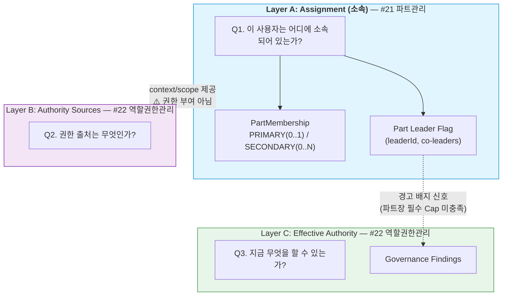
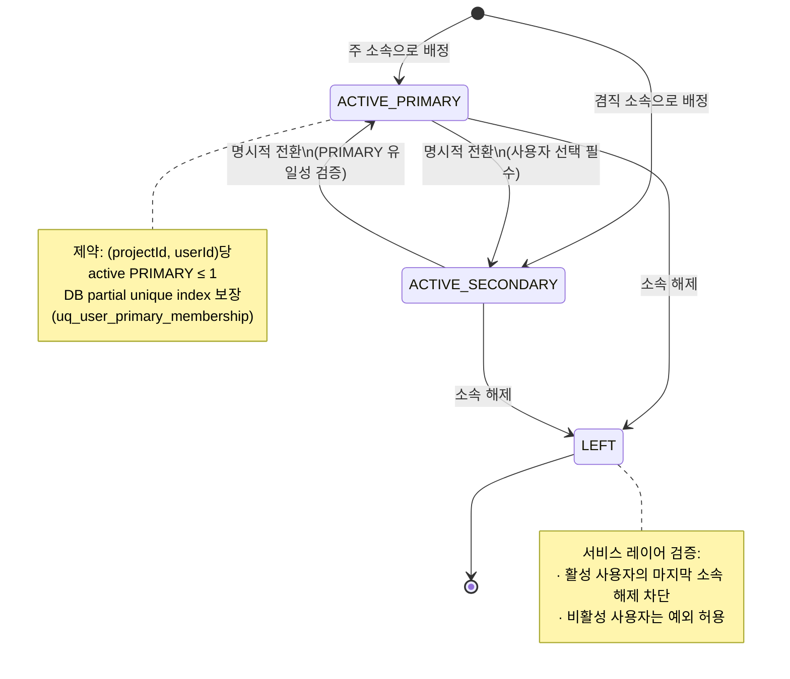
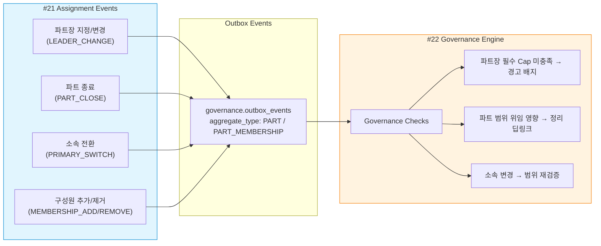

# 21. 파트 관리 화면설계 (조직/소속 관리 / Assignment Layer)

> 작성일: 2026-02-09
> 버전: v1.2
> 라우트: `/parts`
> 필요 Capability: `view_part`, `manage_part`, `manage_part_member`
> 기본 Preset: `PM_WORK`
> 노드 역할: **Detail** (상세 노드 — 소속 구조 조회·편집)
> DB 설계: [20_22_DB설계_권한거버넌스.md §2](20_22_DB설계_권한거버넌스.md) (Postgres `organization` schema)

### 변경 이력

| 버전 | 날짜 | 변경 내용 |
|------|------|----------|
| v1.0 | 2026-02-09 | 초안 작성 |
| v1.1 | 2026-02-09 | Capability 네이밍 단수 통일, PartType CUSTOM 확장(`customTypeName`), 파트장 필수 정책 명확화, 위임 경고 배지 판정 기준(`PartLeaderRequiredCaps`) 추가, Primary 충돌 시 명시적 선택 UX, 비활성 사용자 예외 규칙, 파트 종료 시 위임 딥링크 가이드, 배지 PartType별 severity 매핑 |
| v1.2 | 2026-02-09 | 통합 상태 모델 §4.7 신설 — Layer A(Assignment) 위치 정의, Membership State Machine, Governance Signal Flow 추가. #22와 3-Layer 통합 모델 연동 |

---

## 0. Capability 네이밍 컨벤션 (v1.1 확정)

> **확정 룰**: 단수형 (`domain_action_target`) — #20(`view_project`)과 일관성 유지

| v1.0 | v1.1 (확정) | 비고 |
|------|------------|------|
| `view_parts` | `view_part` | 조회 권한 |
| `manage_parts` | `manage_part` | 파트 CRUD |
| `manage_part_members` | `manage_part_member` | 구성원 관리 |

> **전체 규칙**: `{action}_{domain}` 또는 `{action}_{domain}_{target}` 형태.
> 도메인은 단수, 대상이 있으면 단수로 붙인다.
> 예: `view_project`, `edit_project_accountability`, `manage_part`, `manage_part_member`

---

## 1. 화면 개요

### 1.1 목적

파트 관리 화면의 정체성은 명확하다.

> **"이 사람은 어디에 속해 있는가?"**

파트는:
- **조직 단위** — 맞음
- 권한 단위 — **아님**
- 승인 단위 — **아님**

파트는 **사람의 '위치'**를 정의할 뿐,
**사람의 '힘'**을 정의하지 않는다.

> **핵심 원칙**: "파트 = 조직도, 권한 = 다른 문제"
> 파트에 소속된다고 해서 어떤 권한도 자동으로 부여되지 않는다.
> 파트장은 관리자 역할이지, 권한을 가진 존재가 아니다.

### 1.2 설계 원칙

| 원칙 | 설명 |
|------|------|
| **소속 전용** | 파트는 업무 소속의 단위이지, 권한의 단위가 아님 |
| **겸직 허용** | 사용자는 Primary/Secondary로 복수 파트 소속 가능 |
| **최소 1파트** | 모든 **활성 프로젝트 참여 사용자**는 반드시 1개 이상 파트에 소속 (비활성/제외 사용자는 예외 — §10.1 참조) |
| **파트장 필수** | ACTIVE 상태 파트는 반드시 1명의 주 파트장(leaderId) 지정 필수. 공동 파트장은 보조 역할 |
| **파트장 ≠ 권한** | 파트장 지정은 관리적 역할이며, 시스템 권한을 자동 부여하지 않음 |
| **권한 분리 명시** | "권한은 이 화면에서 다루지 않습니다" 안내를 일관되게 표시 |
| **경고 UX** | 파트장에게 PartType별 최소 필요 위임이 없는 경우 경고 배지 표시 (§5.3 참조) |
| **Primary 명시적 선택** | Primary 충돌 시 자동 전환하지 않고, 사용자가 "Primary 이동" 또는 "Secondary 추가"를 명시적으로 선택 |

### 1.3 핵심 질문 → 화면 요소 매핑

| 사용자 질문 | 화면 요소 | 동작 |
|-----------|----------|------|
| "파트가 몇 개야?" | 파트 목록 | 전체 파트 카드 표시 |
| "이 사람 어느 팀이야?" | 사용자 상세 패널 | 소속 파트 목록 표시 |
| "AI 개발 파트 인원 보여줘" | 파트 상세 확장 | 구성원 리스트 표시 |
| "파트장이 누구야?" | 파트 카드 | 파트장 이름 표시 |
| "파트를 새로 만들고 싶어" | 파트 생성 버튼 | 생성 모달 |
| "이 사람을 파트에 추가해줘" | 구성원 관리 | 사용자 추가 모달 |
| "겸직 상태 확인해줘" | 사용자 상세 패널 | Primary/Secondary 표시 |
| "파트장이 승인 권한 있어?" | 파트 카드 경고 배지 | 미충족 Cap 목록 + 위임 관리 이동 딥링크 |

---

## 2. MenuOntology 노드

### 2.1 타입 확정

| 항목 | 값 | 비고 |
|------|-----|------|
| `nodeId` | `parts` | 단일 노드 |
| `domain` | `"organization"` | 조직 도메인 |
| `nodeRole` | `"detail"` | 소속 조회/편집 (목록 질문에 +5 가산) |
| `entities` | `"Part"`, `"User"`, `"PartMember"` | 관련 엔티티 |
| `requiredCaps` | `["view_part"]` | 조회 최소 권한 |
| `editCaps` | `["manage_part", "manage_part_member"]` | 편집 권한 |

### 2.2 MenuOntologyNode 정의

```typescript
const partsNode: MenuOntologyNode = {
  nodeId: "parts",
  label: "파트 관리",
  route: "/parts",
  icon: "Users",
  domain: "organization",
  nodeRole: "detail",
  entities: ["Part", "User", "PartMember"],
  requiredCaps: ["view_part"],

  intents: [
    "organization_view",      // 조직 구조 조회
    "part_management",        // 파트 생성/수정
    "member_assignment",      // 사용자 소속 관리
    "part_leader_check",      // 파트장 확인
    "concurrent_membership",  // 겸직 조회
  ],

  keywords: [
    "파트", "팀", "조직", "소속", "구성원", "파트장",
    "겸직", "Primary", "Secondary", "파트 추가",
    "인원", "구성", "배치",
  ],

  scopeKeys: ["project", "part"],

  suggestedActions: [
    {
      actionId: "create-part",
      label: "파트 생성",
      requiredCaps: ["manage_part"],
      route: "/parts",
    },
    {
      actionId: "add-member",
      label: "구성원 추가",
      requiredCaps: ["manage_part_member"],
      route: "/parts",
    },
    {
      actionId: "go-to-role-permission",
      label: "역할/권한 관리로 이동",
      requiredCaps: ["view_role_permission"],
      route: "/role-permission",
      /** UI 노출 규칙: view_role_permission Cap 없으면 링크 숨김 */
    },
  ],

  deepLinks: {
    patterns: ["/parts/:partId"],
  },
};
```

> **v1.1 UI 노출 규칙**: `suggestedActions`의 `requiredCaps`를 보유하지 않은 사용자에게는
> 해당 링크를 **숨김 처리** (비활성이 아닌 완전 미노출). 특히 `go-to-role-permission`은
> `view_role_permission` Cap이 없으면 노출하지 않는다.

---

## 3. 허용/금지 행위 매트릭스

### 3.1 허용 행위 (Do)

| 행위 | 상세 | 필요 Capability |
|------|------|----------------|
| 파트 목록 조회 | 프로젝트 내 전체 파트 표시 | `view_part` |
| 파트 생성 | 새 파트 추가 (이름, 유형 지정) | `manage_part` |
| 파트 수정 | 파트 이름, 유형, 상태 변경 | `manage_part` |
| 파트 종료 | 파트 비활성화 (삭제가 아닌 종료) | `manage_part` |
| 사용자 소속 할당 | 사용자를 파트에 추가 | `manage_part_member` |
| 사용자 소속 해제 | 사용자를 파트에서 제거 | `manage_part_member` |
| 겸직 설정 | Primary/Secondary 구분 지정 | `manage_part_member` |
| 파트장 지정 | 파트별 주 파트장 1명 필수 지정 | `manage_part` |
| 공동 파트장 지정 | 보조 파트장 0~N명 지정 | `manage_part` |
| 사용자 소속 조회 | 특정 사용자의 전체 소속 파트 조회 | `view_part` |

### 3.2 금지 행위 (Do Not)

| 금지 항목 | 사유 | 대신 사용할 메뉴 |
|----------|------|----------------|
| Capability 직접 부여 | 권한은 역할/권한 관리에서만 | 역할 및 권한 관리 |
| 승인 권한 설정 | 승인 권한은 위임의 영역 | 역할 및 권한 관리 |
| 위임 기간 설정 | 위임은 권한 관리의 책임 | 역할 및 권한 관리 |
| SoD 검증 | 거버넌스는 권한 관리의 책임 | 역할 및 권한 관리 |
| 역할(Role) 부여 | 역할은 권한 관리에서만 | 역할 및 권한 관리 |
| PM 변경 | 책임 주체는 프로젝트 관리의 책임 | 프로젝트 관리 |
| 위임 수정/해지 | 위임은 권한 관리의 책임 (리스트업은 가능, 수정은 불가) | 역할 및 권한 관리 |

---

## 4. 핵심 엔티티 & 데이터 모델

### 4.1 관련 엔티티

```
Project ──1:N──▶ Part
Part    ──1:N──▶ PartMember ──N:1──▶ User
Part    ──1:1──▶ Leader (User)         // 주 파트장 — ACTIVE 파트에서 필수
Part    ──0:N──▶ CoLeader (User)       // 공동 파트장 — 보조, 선택
Part    ──0:1──▶ PartLeaderRequiredCaps // 파트 타입별 최소 필요 위임 정책
```

### 4.2 파트 (Part)

```typescript
interface Part {
  id: string;
  projectId: string;
  name: string;
  partType: PartType;
  /**
   * partType === "CUSTOM"일 때 필수.
   * UI에서 사용자 정의 유형 선택 시 이름 입력 강제.
   * 검색/필터에서 활용됨.
   */
  customTypeName?: string;
  status: "ACTIVE" | "CLOSED";
  /**
   * 주 파트장 — ACTIVE 파트에서 필수 (null 불가).
   * 공동 파트장(coLeaderIds)이 있어도 leaderId가 없으면 빨강 경고 유지.
   * 파트장은 "책임의 앵커"이지, 공동 파트장은 "보조/대체"일 뿐이다.
   */
  leaderId: string;
  leaderName: string;
  /** 공동 파트장 — 선택. 보조/대체 역할 */
  coLeaderIds?: string[];
  createdAt: string;
  closedAt?: string;
}

type PartType =
  | "AI_DEVELOPMENT"      // AI 개발
  | "SI_DEVELOPMENT"      // SI 개발
  | "QA"                  // QA
  | "BUSINESS_ANALYSIS"   // BA
  | "COMMON"              // 공통
  | "PMO"                 // PMO
  | "CUSTOM";             // 사용자 정의 — customTypeName 필수
```

> **v1.1 CUSTOM 확장**: `CUSTOM` 하나로는 여러 사용자 정의 유형이 구분되지 않으므로,
> `customTypeName`을 추가하여 "데이터 분석", "보안", "인프라" 등을 자유롭게 지정하고
> 필터/검색에서 활용할 수 있게 한다.

### 4.3 파트장 최소 필요 위임 정책 (PartLeaderRequiredCaps) — v1.1 신규

> **이 정책이 경고 배지(§5.3)의 근거 데이터가 된다.**

```typescript
/**
 * 파트 타입별 "파트장에게 최소한 위임되어야 하는 Capability" 정의.
 * 이 정책은 프로젝트 수준 설정 (/admin/project?tab=parts)에서
 * 커스터마이즈 가능하며, 기본값은 아래와 같다.
 *
 * 판정 기준: 파트장(leaderId)이 아래 Cap을 Delegation으로 보유하지 않으면
 * hasDelegationWarning = true + missingCaps 배열에 미충족 Cap 추가.
 */
const PART_LEADER_REQUIRED_CAPS: Record<PartType, string[]> = {
  AI_DEVELOPMENT:    ["approve_code", "assign_task"],
  SI_DEVELOPMENT:    ["approve_merge", "assign_task"],
  QA:                ["approve_test", "manage_defect"],
  BUSINESS_ANALYSIS: ["approve_requirement"],
  COMMON:            [],                              // 공통 파트는 기본 요구 없음
  PMO:               ["approve_report"],
  CUSTOM:            [],                              // 커스텀은 프로젝트 설정에서 지정
};
```

| PartType | 최소 요구 Capability | 미충족 시 배지 |
|----------|---------------------|-------------|
| `AI_DEVELOPMENT` | `approve_code`, `assign_task` | ⚠ 주황 |
| `SI_DEVELOPMENT` | `approve_merge`, `assign_task` | ⚠ 주황 |
| `QA` | `approve_test`, `manage_defect` | ⚠ 주황 |
| `BUSINESS_ANALYSIS` | `approve_requirement` | ⚠ 주황 |
| `COMMON` | 없음 (운영 정책으로 추가 가능) | - |
| `PMO` | `approve_report` | ⚠ 주황 |
| `CUSTOM` | 프로젝트 설정에서 지정 | 설정에 따름 |

### 4.4 파트 멤버십 (PartMembership)

```typescript
interface PartMembership {
  id: string;
  partId: string;
  userId: string;
  userName: string;
  membershipType: "PRIMARY" | "SECONDARY";
  joinedAt: string;
  leftAt?: string;
}
```

### 4.5 DB 스키마 매핑

> 상세 DDL/인덱스/뷰는 [20_22_DB설계_권한거버넌스.md](20_22_DB설계_권한거버넌스.md) 참조.

| TypeScript 엔티티 | Postgres 테이블 | Schema | 비고 |
|-------------------|----------------|--------|------|
| `Part` | `organization.parts` | organization | `chk_custom_type_name` CHECK로 CUSTOM 유형명 필수 보장 |
| 공동 파트장 (`coLeaderIds`) | `organization.part_co_leaders` | organization | PK(part_id, user_id), 0..N명 |
| `PartMembership` | `organization.part_memberships` | organization | 부분 unique index `uq_user_primary_membership`로 Primary 단일성 보장 |
| (변경 이력) | `organization.assignment_change_log` | organization | 소속/파트장/파트 상태 변경 감사 |
| 파트장 경고 배지 | 계산 쿼리 (§7.6) | governance + organization | `v_delegated_caps` 조인으로 미충족 Cap 산출 |

**핵심 DB 레벨 보장:**

- **Primary 단일성**: `uq_user_primary_membership` (partial unique index: `WHERE left_at IS NULL AND membership_type = 'PRIMARY'`) — 프로젝트 내 사용자당 활성 PRIMARY 소속은 최대 1개
- **CUSTOM 유형명 필수**: `chk_custom_type_name` CHECK — `part_type='CUSTOM'`이면 `custom_type_name`이 반드시 존재
- **파트장 필수**: DB에서는 `leader_user_id` NULLABLE (CLOSED 파트 허용), ACTIVE 파트 필수 검증은 서비스 레이어
- **마지막 소속 제거 차단**: DB 제약으로 표현 불가 → 서비스 레이어 트랜잭션 내 검증
- **Neo4j 동기**: 파트/멤버십 변경 시 `(:User)-[:MEMBER_OF]->(:Part)`, `(:User)-[:LEADS]->(:Part)` 관계 갱신 (Outbox 이벤트)

### 4.6 사용자 소속 요약 (UserPartSummary)

```typescript
interface UserPartSummary {
  userId: string;
  userName: string;
  memberships: {
    partId: string;
    partName: string;
    partType: PartType;
    membershipType: "PRIMARY" | "SECONDARY";
    isLeader: boolean;
  }[];
  /**
   * 역할/권한 정보는 여기에 포함하지 않음 — 별도 API.
   * "출처"는 절대 넣지 않는다 (권한 화면의 책임).
   * 이동 시 사용자 필터 딥링크를 제공한다.
   */
  hasRole: boolean;         // 역할 보유 여부만 표시
  hasDelegation: boolean;   // 위임 보유 여부만 표시
  /** 역할/권한 상세 이동 딥링크 */
  rolePermissionDeepLink: string;  // e.g. "/role-permission/{projectId}/users/{userId}"
}
```

---

## 4.7 통합 상태 모델에서의 위치 (Layer A — Assignment)

> **참조**: 전체 3-Layer 통합 모델은 [22_역할권한관리_화면설계.md §4.9](22_역할권한관리_화면설계.md)에서 정의한다.
> 이 절은 Layer A(Assignment)가 전체 모델에서 어떤 역할을 하는지, 그리고 #22(Authority)와의 경계를 명확히 한다.

### 4.7.1 3-Layer 개념 모델에서의 Layer A 위치



**핵심 원칙**: Assignment(Layer A)는 **권한을 부여하지 않는다**. 소속과 역할의 컨텍스트/스코프만 제공하며,
실제 권한 부여는 반드시 Layer B(#22 역할 및 권한 관리)에서만 수행된다.

| Layer A 제공 정보 | 용도 | 권한 효과 |
|------------------|------|----------|
| `PartMembership.partId` | 위임의 `scopeType=PART` 범위 결정 | 없음 (스코프만 제공) |
| `Part.leaderId` | 파트장 경고 배지 판정 대상 결정 | 없음 (배지 = 거버넌스 경고, 권한 아님) |
| `PartMembership.type` (PRIMARY/SECONDARY) | 사용자 조직 배치 파악 | 없음 (조직도 전용) |

### 4.7.2 Membership State Machine



**상태 전이 규칙:**

| 전이 | 조건 | 검증 |
|------|------|------|
| `[*] → ACTIVE_PRIMARY` | 신규 배정 | 해당 프로젝트에서 기존 PRIMARY 없어야 함 (있으면 선택 UI 표시) |
| `[*] → ACTIVE_SECONDARY` | 겸직 배정 | 제한 없음 (0..N 허용) |
| `ACTIVE_PRIMARY ↔ ACTIVE_SECONDARY` | 명시적 전환 | 자동 전환 금지 — 반드시 사용자가 선택 |
| `ACTIVE_* → LEFT` | 소속 해제 | 활성 사용자의 마지막 소속이면 차단 + 안내 |

**DB 보장 vs 서비스 레이어:**

| 규칙 | 적용 수준 | 근거 |
|------|----------|------|
| PRIMARY 유일성 (프로젝트당 사용자당 1개) | DB (partial unique index) | `uq_user_primary_membership` |
| 마지막 소속 해제 차단 | 서비스 레이어 | DB 제약으로 표현 불가 |
| PRIMARY 전환 시 기존 PRIMARY 확인 | 서비스 레이어 (트랜잭션 내) | 교차 레코드 검증 |

### 4.7.3 Governance Signal Flow

Layer A의 이벤트는 **Governance Engine(#22 §4.9.5)**에 신호를 전달한다.
이 신호는 권한을 변경하지 않으며, 거버넌스 검증 결과(Findings)를 생성할 뿐이다.



| Assignment Signal | Outbox Event Type | Governance 반응 |
|------------------|-------------------|----------------|
| 파트장 지정 | `PART.LEADER_CHANGED` | 신규 파트장의 PartLeaderRequiredCaps 검증 → 미충족 시 경고 배지 |
| 파트 종료 | `PART.CLOSED` | 해당 파트 범위(`scopeType=PART`) 위임 목록 → 정리 필요 표시 |
| PRIMARY ↔ SECONDARY 전환 | `PART_MEMBERSHIP.PRIMARY_SWITCHED` | 위임 범위 재검증 (PART scope 해당 여부) |
| 구성원 추가 | `PART_MEMBERSHIP.MEMBER_ADDED` | 신규 구성원 기존 역할/위임 범위와 교차 검증 |
| 구성원 제거 | `PART_MEMBERSHIP.MEMBER_REMOVED` | 해당 사용자의 PART scope 위임 유효성 재검증 |

### 4.7.4 #21 ↔ #22 경계 원칙 (v1.2 확정)

| 원칙 | #21 (Assignment) | #22 (Authority) |
|------|------------------|-----------------|
| 데이터 소유 | 소속(Part, Membership) | 권한(Role, Capability, Delegation) |
| 권한 부여 | **불가** — 읽기 전용 배지만 표시 | **유일한 장소** — 모든 권한 변경 |
| 거버넌스 신호 | **발신** (Assignment Events) | **수신 + 판정** (Governance Engine) |
| 배지 표시 | 경고 배지 **표시** (read-only) | 경고 배지 **판정 근거** 생성 |
| 상호 이동 | 딥링크로 #22 이동 | 딥링크로 #21 이동 |
| DB 스키마 | `organization.*` | `governance.*` |

---

## 5. 화면 레이아웃

### 5.1 전체 구조

```
┌─────────────────────────────────────────────────────────────────┐
│  [Header] 파트 관리                              [+ 파트 생성]   │
│  프로젝트: AI 보험심사 처리 시스템                                 │
├───────────────────────────────────┬──────────────────────────────┤
│                                   │                              │
│  파트 목록                         │  사용자 상세 (Side Panel)     │
│                                   │                              │
│  ┌─────────────────────────────┐  │  ┌────────────────────────┐  │
│  │  AI 개발 파트         ⚠     │  │  │  홍길동                 │  │
│  │  파트장: 박OO               │  │  │                        │  │
│  │  구성원: 6명                │  │  │  소속 파트:             │  │
│  │  유형: AI_DEVELOPMENT      │  │  │  • AI 개발 (Primary)   │  │
│  │  [▾ 구성원 보기]            │  │  │  • 공통 (Secondary)    │  │
│  └─────────────────────────────┘  │  │                        │  │
│                                   │  │  역할: 없음             │  │
│  ┌─────────────────────────────┐  │  │  권한: 없음             │  │
│  │  SI 개발 파트               │  │  │                        │  │
│  │  파트장: 이OO               │  │  │  ⓘ 권한은 '역할 및     │  │
│  │  구성원: 8명                │  │  │  권한 관리'에서만       │  │
│  │  유형: SI_DEVELOPMENT      │  │  │  부여됩니다.            │  │
│  │  [▾ 구성원 보기]            │  │  │                        │  │
│  └─────────────────────────────┘  │  │  → 역할/권한 관리       │  │
│                                   │  │    (view_role_permission│  │
│  ┌─────────────────────────────┐  │  │     없으면 숨김)        │  │
│  │  QA 파트                    │  │  └────────────────────────┘  │
│  │  파트장: 최OO               │  │                              │
│  │  구성원: 4명                │  │                              │
│  │  유형: QA                  │  │                              │
│  │  [▾ 구성원 보기]            │  │                              │
│  └─────────────────────────────┘  │                              │
│                                   │                              │
│  ┌─────────────────────────────┐  │                              │
│  │  공통 파트                   │  │                              │
│  │  파트장: 없음         🔴    │  │                              │
│  │  구성원: 5명                │  │                              │
│  │  유형: COMMON              │  │                              │
│  │  [▾ 구성원 보기]            │  │                              │
│  └─────────────────────────────┘  │                              │
│                                   │                              │
└───────────────────────────────────┴──────────────────────────────┘
```

> **v1.1 변경**: 프로젝트 컨텍스트를 Header에 명시 (프로젝트명 표시).
> #20과 동일한 "프로젝트 선택/고정" 패턴.

### 5.2 파트 상세 (구성원 확장)

```
┌─────────────────────────────────────────────────┐
│  AI 개발 파트                             ⚠     │
│  파트장(주): 박OO                                 │
│  공동 파트장: 없음                                 │
│  유형: AI_DEVELOPMENT                            │
│  상태: ACTIVE                                    │
│                                                  │
│  ⚠ 파트장에게 다음 권한이 위임되지 않았습니다:       │
│    • approve_code (코드 승인)                      │
│    → 역할 및 권한 관리에서 위임 설정                 │
│      /role-permission?scopeType=PART               │
│      &scopeId={partId}&tab=delegation-map          │
│                                                  │
│  ──────────────────────────────────────────────   │
│                                                  │
│  구성원 (6명)                     [+ 구성원 추가]  │
│                                                  │
│  이름      소속 유형    역할여부   클릭            │
│  ─────────────────────────────────────────────    │
│  박OO      Primary    ✓ 있음    [상세 →]         │
│  홍길동    Primary    ✗ 없음    [상세 →]         │
│  김OO      Primary    ✗ 없음    [상세 →]         │
│  이OO      Secondary  ✓ 있음    [상세 →]         │
│  정OO      Primary    ✗ 없음    [상세 →]         │
│  한OO      Primary    ✗ 없음    [상세 →]         │
│                                                  │
└─────────────────────────────────────────────────┘
```

> **v1.1 변경**: 경고 메시지에 **구체적 미충족 Cap 이름**을 표시하고,
> 역할/권한 관리로의 **필터 적용 딥링크**를 제공하여
> 경계를 유지하면서도 운영 동선을 단축한다.

### 5.3 경고 배지 규칙 (v1.1 보강)

#### 기본 배지 규칙

| 조건 | 배지 | 설명 |
|------|------|------|
| 파트장(leaderId) 미지정 | 🔴 빨강 | "파트장이 지정되지 않았습니다" — ACTIVE 파트에서 가장 심각 |
| 파트장 있음 + PartLeaderRequiredCaps 미충족 | ⚠ 주황 | "파트장에게 {미충족 Cap 목록} 위임이 필요합니다" |
| 구성원 0명 | 아래 PartType별 severity 참조 | PartType에 따라 심각도 차등 |

#### PartType별 "구성원 0명" 배지 severity (v1.1 신규)

| PartType | 구성원 0명 배지 | 사유 |
|----------|-------------|------|
| `QA` | ⚠ 주황 | QA 파트가 비어있으면 테스트 공백 위험 |
| `AI_DEVELOPMENT` | ⚠ 주황 | 핵심 개발 파트 공백은 위험 |
| `SI_DEVELOPMENT` | ⚠ 주황 | 핵심 개발 파트 공백은 위험 |
| `BUSINESS_ANALYSIS` | ⓘ 회색 | 프로젝트 초기엔 비어있을 수 있음 |
| `COMMON` | ⓘ 회색 | 공통 파트는 비어있을 수 있음 |
| `PMO` | ⓘ 회색 | PMO 파트는 프로젝트 규모에 따라 유동적 |
| `CUSTOM` | ⓘ 회색 | 기본값, 프로젝트 설정으로 변경 가능 |

---

## 6. 파트 생성/수정 플로우

### 6.1 파트 생성 모달

```
┌──────────────────────────────────────────┐
│  파트 생성                         [✕]   │
├──────────────────────────────────────────┤
│                                          │
│  파트명:                                  │
│  ┌────────────────────────────────────┐   │
│  │                                    │   │
│  └────────────────────────────────────┘   │
│                                          │
│  파트 유형:  [▾ 선택]                      │
│  ┌────────────────────────────────────┐   │
│  │  AI 개발                           │   │
│  │  SI 개발                           │   │
│  │  QA                               │   │
│  │  비즈니스 분석                       │   │
│  │  공통                              │   │
│  │  PMO                              │   │
│  │  사용자 정의                        │   │
│  └────────────────────────────────────┘   │
│                                          │
│  (사용자 정의 선택 시)                      │
│  사용자 정의 유형명 (필수):                  │
│  ┌────────────────────────────────────┐   │
│  │  예: 데이터 분석, 보안, 인프라       │   │
│  └────────────────────────────────────┘   │
│                                          │
│  파트장 (필수):  [사용자 검색 ▾]            │
│                  ________________________ │
│                                          │
│  ⓘ 파트장을 지정하더라도 승인 권한은        │
│    자동으로 부여되지 않습니다.              │
│    권한 위임은 '역할 및 권한 관리'에서       │
│    별도로 설정해 주세요.                    │
│                                          │
│  ⓘ 이 파트 유형의 최소 필요 위임:           │
│    • approve_code (코드 승인)              │
│    • assign_task (태스크 할당)              │
│                                          │
│         [취소]     [파트 생성]             │
└──────────────────────────────────────────┘
```

> **v1.1 변경사항**:
> - 파트장: 선택사항 → **필수** (ACTIVE 파트 정책 반영)
> - "사용자 정의" 선택 시 `customTypeName` 입력 필드 노출 (필수)
> - 생성 시 해당 PartType의 최소 필요 위임 Cap을 **사전 안내**하여
>   파트장 지정 직후 위임 설정이 필요하다는 것을 인지시킴

### 6.2 구성원 추가 모달 (v1.1 Primary 충돌 처리)

```
┌──────────────────────────────────────────┐
│  구성원 추가                       [✕]   │
├──────────────────────────────────────────┤
│                                          │
│  대상 파트: AI 개발 파트                   │
│                                          │
│  사용자 검색:                              │
│  ┌────────────────────────────────────┐   │
│  │  검색...                           │   │
│  └────────────────────────────────────┘   │
│                                          │
│  검색 결과:                               │
│  ┌────────────────────────────────────┐   │
│  │  ☑ 강OO  (현재: QA파트 Primary)     │   │
│  │  ☑ 윤OO  (소속 없음)               │   │
│  │  ☐ 장OO  (현재: SI개발 Primary)     │   │
│  └────────────────────────────────────┘   │
│                                          │
│  소속 유형:                               │
│  ○ Primary (주 소속)                      │
│  ● Secondary (겸직)                      │
│                                          │
│  ──── Primary 충돌 감지 ────              │
│  ⚠ 강OO은(는) 이미 QA파트에               │
│    Primary로 소속되어 있습니다.             │
│                                          │
│  처리 방법을 선택해 주세요:                  │
│  ● (A) Primary 이동                       │
│    QA파트를 Secondary로 변경하고            │
│    AI 개발 파트를 Primary로 설정            │
│  ○ (B) Secondary로 추가                   │
│    기존 QA파트 Primary를 유지하고           │
│    AI 개발 파트를 Secondary로 추가          │
│                                          │
│         [취소]     [추가]                 │
└──────────────────────────────────────────┘
```

> **v1.1 핵심 변경**: Primary 충돌 시 자동 전환하지 않는다.
> 사용자(관리자)가 **명시적으로 (A) 또는 (B)**를 선택해야 저장 가능.
> 이유: 감사/분쟁 포인트를 줄이고, 의도하지 않은 Primary 변경을 방지.

### 6.3 파트 종료 플로우 (v1.1 위임 딥링크 가이드 추가)

```
파트 종료 요청
    │
    ▼
┌─────────────────────┐
│ 소속 구성원 확인     │──── 구성원 있음 → 재배치 안내
└─────────────────────┘
    │
    ▼
┌──────────────────────────────────────────────────┐
│ 영향 분석 (ImpactPreviewDialog)                    │
│ - 소속 구성원 N명                                  │
│ - 해당 파트 범위 위임 N건 (리스트업 표시)             │
│ - 파트장 역할 해제                                  │
│                                                    │
│ ⓘ 위임 정리 안내:                                   │
│   아래 위임이 이 파트 범위로 설정되어 있습니다.        │
│   파트 종료 후 위임 범위를 조정해 주세요.              │
│                                                    │
│   • 김OO ← 코드 승인 (from 박OO)                   │
│   • 이OO ← 테스트 승인 (from 박OO)                  │
│                                                    │
│   [수정 버튼 없음 — 경계 유지]                       │
│   → 역할 및 권한 관리에서 위임 정리                    │
│     /role-permission?scopeType=PART                 │
│     &scopeId={partId}&status=ACTIVE                 │
└──────────────────────────────────────────────────┘
    │
    ▼
┌─────────────────────┐
│ 구성원 재배치        │──── 다른 파트로 이동 or 미소속 경고
└─────────────────────┘
    │
    ▼
┌─────────────────────┐
│ 파트 상태 → CLOSED  │
└─────────────────────┘
    │
    ▼
  완료 (파트 목록에서 비노출, 이력 보존)
```

> **v1.1 변경**: 영향 분석에서 위임 목록을 **리스트업**하되,
> 수정 버튼은 제공하지 않고 **필터 적용 딥링크만 제공**하여 경계를 유지한다.

---

## 7. Preset별 화면 분기

| Preset | 노출 요소 | 편집 가능 여부 |
|--------|---------|-------------|
| `EXEC_SUMMARY` | 파트 목록 요약 (카드 형태, 구성원 수만) | 편집 불가 |
| `PMO_CONTROL` | 전체 표시, 파트 생성/수정/종료 가능 | 전체 편집 |
| `PM_WORK` | 전체 표시, 파트 생성/수정/종료 가능 | 전체 편집 |
| `DEV_EXECUTION` | 본인 소속 파트만 표시 (Read-only) | 편집 불가 |
| `CUSTOMER_APPROVAL` | 파트 목록 요약 (Read-only) | 편집 불가 |
| `AUDIT_EVIDENCE` | 전체 파트 + 구성원 (Read-only, Export 가능) | 편집 불가 |

---

## 8. API 명세

### 8.1 파트 목록 조회 (v1.1 delegationWarning 상세화)

```
GET /api/projects/{projectId}/parts

Response 200:
{
  "parts": [
    {
      "id": "uuid",
      "name": "AI 개발 파트",
      "partType": "AI_DEVELOPMENT",
      "customTypeName": null,
      "status": "ACTIVE",
      "leader": { "id": "uuid", "name": "박OO" },
      "coLeaders": [],
      "memberCount": 6,
      "delegationWarning": {
        "hasWarning": true,
        "missingCaps": ["approve_code"],
        "targetUserId": "leader-uuid",
        "targetUserName": "박OO"
      }
    },
    {
      "id": "uuid",
      "name": "데이터 분석 파트",
      "partType": "CUSTOM",
      "customTypeName": "데이터 분석",
      "status": "ACTIVE",
      "leader": { "id": "uuid", "name": "조OO" },
      "coLeaders": [],
      "memberCount": 3,
      "delegationWarning": {
        "hasWarning": false,
        "missingCaps": [],
        "targetUserId": null,
        "targetUserName": null
      }
    }
  ]
}
```

> **v1.1 변경**: `hasDelegationWarning: boolean` → `delegationWarning` 객체로 교체.
> `missingCaps`에 미충족 Cap 코드를 포함하여 UX에서 "왜 경고인지"를 구체적으로 표시.

### 8.2 파트 상세 (구성원 포함)

```
GET /api/projects/{projectId}/parts/{partId}

Response 200:
{
  "id": "uuid",
  "name": "AI 개발 파트",
  "partType": "AI_DEVELOPMENT",
  "customTypeName": null,
  "status": "ACTIVE",
  "leader": { "id": "uuid", "name": "박OO" },
  "coLeaders": [],
  "members": [
    {
      "id": "uuid",
      "userId": "uuid",
      "userName": "홍길동",
      "membershipType": "PRIMARY",
      "hasRole": false,
      "hasDelegation": false,
      "joinedAt": "2025-10-15T09:00:00Z"
    }
  ],
  "delegationWarning": {
    "hasWarning": true,
    "missingCaps": ["approve_code"],
    "targetUserId": "leader-uuid",
    "targetUserName": "박OO"
  },
  "requiredLeaderCaps": ["approve_code", "assign_task"]
}
```

### 8.3 파트 생성 (v1.1 customTypeName, leaderId 필수)

```
POST /api/projects/{projectId}/parts

Request:
{
  "name": "데이터 분석 파트",
  "partType": "CUSTOM",
  "customTypeName": "데이터 분석",
  "leaderId": "uuid"
}

Response 201:
{
  "id": "uuid",
  "name": "데이터 분석 파트",
  "partType": "CUSTOM",
  "customTypeName": "데이터 분석",
  "status": "ACTIVE",
  "leader": { "id": "uuid", "name": "조OO" },
  "coLeaders": [],
  "memberCount": 0,
  "requiredLeaderCaps": []
}

Response 400 (CUSTOM인데 customTypeName 없음):
{
  "error": "CUSTOM_TYPE_NAME_REQUIRED",
  "message": "사용자 정의 유형은 유형명을 반드시 입력해야 합니다."
}

Response 400 (leaderId 없음):
{
  "error": "LEADER_REQUIRED",
  "message": "파트장은 필수입니다. 파트 생성 시 반드시 지정해 주세요."
}
```

### 8.4 구성원 추가 (v1.1 Primary 충돌 처리)

```
POST /api/projects/{projectId}/parts/{partId}/members

Request:
{
  "userIds": ["uuid1", "uuid2"],
  "membershipType": "PRIMARY",
  "primaryConflictResolution": "TRANSFER"
}

// primaryConflictResolution (membershipType === "PRIMARY"일 때만 유효):
//   "TRANSFER" — 기존 Primary를 Secondary로 변경, 새 파트를 Primary로
//   "SKIP"     — Primary 충돌 사용자는 Secondary로 자동 전환
//
// membershipType === "SECONDARY"이면 이 필드 무시

Response 200:
{
  "added": 2,
  "members": [
    {
      "userId": "uuid1",
      "userName": "강OO",
      "membershipType": "PRIMARY",
      "previousPrimary": {
        "partId": "uuid",
        "partName": "QA파트",
        "newMembershipType": "SECONDARY"
      }
    },
    { "userId": "uuid2", "userName": "윤OO", "membershipType": "PRIMARY" }
  ]
}
```

### 8.5 구성원 제거 (v1.1 비활성 사용자 예외)

```
DELETE /api/projects/{projectId}/parts/{partId}/members/{userId}

Response 200:
{
  "removed": true,
  "warning": "이 사용자는 다른 파트에 소속되어 있지 않습니다."
}

Response 400 (최소 소속 위반 — 활성 사용자만 적용):
{
  "error": "LAST_MEMBERSHIP",
  "message": "활성 프로젝트 참여 사용자는 최소 1개 파트에 소속되어야 합니다. 다른 파트에 먼저 추가해 주세요."
}

// 비활성 사용자(INACTIVE / 프로젝트 제외)는 최소 1파트 규칙 미적용.
// 프로젝트 제외 프로세스에서 PartMembership 정리 가능.
```

### 8.6 사용자 소속 조회 (v1.1 딥링크 포함)

```
GET /api/projects/{projectId}/users/{userId}/parts

Response 200:
{
  "userId": "uuid",
  "userName": "홍길동",
  "memberships": [
    {
      "partId": "uuid",
      "partName": "AI 개발 파트",
      "partType": "AI_DEVELOPMENT",
      "membershipType": "PRIMARY",
      "isLeader": false
    },
    {
      "partId": "uuid",
      "partName": "공통 파트",
      "partType": "COMMON",
      "membershipType": "SECONDARY",
      "isLeader": false
    }
  ],
  "hasRole": false,
  "hasDelegation": false,
  "rolePermissionDeepLink": "/role-permission/users/uuid"
}
```

### 8.7 파트 종료 (v1.1 위임 영향 상세)

```
PUT /api/projects/{projectId}/parts/{partId}/close

Response 200:
{
  "closed": true,
  "impactSummary": {
    "affectedMembers": 6,
    "affectedDelegations": [
      {
        "delegationId": "uuid",
        "delegateeName": "김OO",
        "capabilityName": "코드 승인",
        "delegatorName": "박OO"
      },
      {
        "delegationId": "uuid",
        "delegateeName": "이OO",
        "capabilityName": "테스트 승인",
        "delegatorName": "박OO"
      }
    ],
    "unassignedMembers": ["uuid1", "uuid3"],
    "delegationCleanupLink": "/role-permission?scopeType=PART&scopeId={partId}&status=ACTIVE"
  }
}
```

---

## 9. 컴포넌트 설계

### 9.1 컴포넌트 트리

```
PartManagementPage
├── ProjectContextHeader                   # 프로젝트 컨텍스트 표시 (v1.1)
├── PartListPanel                          # 좌측: 파트 목록
│   ├── CreatePartButton                   # 파트 생성 버튼
│   ├── PartCard                           # 파트 카드
│   │   ├── PartLeaderBadge                # 파트장 표시 (주/공동 구분)
│   │   ├── MemberCountBadge               # 구성원 수
│   │   ├── DelegationWarningBadge         # 위임 경고 (미충족 Cap 표시)
│   │   ├── EmptyPartWarningBadge          # 구성원 0명 경고 (PartType별 severity)
│   │   └── ExpandMembersToggle            # 구성원 확장 토글
│   └── PartMemberList (확장 시)            # 구성원 리스트
│       ├── MemberRow                      # 구성원 행
│       │   ├── MembershipTypeBadge        # Primary/Secondary
│       │   └── RoleIndicator              # 역할 유무 표시
│       └── AddMemberButton                # 구성원 추가 버튼
├── UserDetailSidePanel                    # 우측: 사용자 상세 패널
│   ├── UserBasicInfo                      # 사용자 기본 정보
│   ├── MembershipList                     # 소속 파트 목록
│   ├── RolePermissionNotice               # "권한은 다른 메뉴" 안내
│   └── NavigationDeepLink                 # 역할/권한 관리 딥링크 (Cap 없으면 숨김)
├── CreatePartModal                        # 파트 생성 모달
│   ├── PartNameInput                      # 파트명
│   ├── PartTypeSelect                     # 파트 유형
│   ├── CustomTypeNameInput (조건부)        # 사용자 정의 유형명 (v1.1)
│   ├── LeaderSearchInput                  # 파트장 검색 (필수)
│   ├── RequiredCapsPreview                # 최소 필요 위임 사전 안내 (v1.1)
│   └── PermissionNotice                   # 권한 안내 메시지
├── AddMemberModal                         # 구성원 추가 모달
│   ├── UserSearchInput                    # 사용자 검색
│   ├── UserCheckList                      # 사용자 선택 목록
│   ├── MembershipTypeRadio                # Primary/Secondary 선택
│   └── PrimaryConflictResolver (조건부)    # Primary 충돌 선택지 (v1.1)
│       ├── TransferPrimaryOption           # (A) Primary 이동
│       └── AddAsSecondaryOption            # (B) Secondary로 추가
└── ClosePartDialog                        # 파트 종료 확인
    └── ImpactPreviewDialog                # 영향 분석 표시
        ├── AffectedMembersList             # 영향 받는 구성원
        ├── AffectedDelegationsList         # 영향 받는 위임 리스트업
        └── DelegationCleanupDeepLink       # 위임 정리 딥링크 (v1.1)
```

### 9.2 상태 관리

```typescript
interface PartManagementState {
  /** 파트 목록 */
  parts: Part[];

  /** 확장된 파트 ID (구성원 보기) */
  expandedPartIds: Set<string>;

  /** 선택된 사용자 (Side Panel 표시) */
  selectedUserId: string | null;
  selectedUserSummary: UserPartSummary | null;

  /** 모달 상태 */
  isCreatePartModalOpen: boolean;
  isAddMemberModalOpen: boolean;
  addMemberTargetPartId: string | null;

  /** v1.1: Primary 충돌 감지 상태 */
  primaryConflicts: {
    userId: string;
    userName: string;
    currentPrimaryPartId: string;
    currentPrimaryPartName: string;
    resolution: "TRANSFER" | "SKIP" | null;  // null = 아직 미선택
  }[];

  /** 파트 종료 확인 */
  isClosePartDialogOpen: boolean;
  closePartTargetId: string | null;
}
```

---

## 10. 비즈니스 규칙

### 10.1 소속 규칙 (v1.1 보강)

| 규칙 | 설명 | 위반 시 처리 |
|------|------|------------|
| 최소 1파트 | **활성 프로젝트 참여 사용자(activeProjectMember)** 기준 최소 1개 파트 소속 | 제거 시 경고, 다른 파트 먼저 배정 필요 |
| 비활성 예외 | 비활성 사용자(INACTIVE) 또는 프로젝트 제외 처리 중인 사용자는 최소 1파트 규칙 **미적용** | 프로젝트 제외/비활성화 프로세스에서 PartMembership 정리 가능 |
| Primary 단일 | Primary 소속은 최대 1개 | **자동 전환 하지 않음** — 사용자(관리자)가 (A) Primary 이동 또는 (B) Secondary 추가를 명시적 선택 |
| Secondary 복수 | Secondary 소속은 제한 없음 | - |
| 파트장(주) 필수 | ACTIVE 파트에서 leaderId는 반드시 1명 | 미지정 시 빨강 경고. 공동 파트장이 있어도 "주 책임자 미지정" 경고 유지 |
| 공동 파트장 선택 | coLeaderIds는 0~N명, 보조/대체 역할 | 주 파트장 없이 공동 파트장만 있는 상태는 허용하지 않음 |

### 10.2 파트 종료 규칙 (v1.1 위임 처리 명확화)

| 규칙 | 설명 |
|------|------|
| 구성원 재배치 | 종료 전 모든 활성 구성원의 다른 파트 소속 확인 |
| 위임 영향 리스트업 | 해당 파트 범위 위임을 **목록으로 표시** (수정은 불가, 딥링크만 제공) |
| 위임 정리 딥링크 | `/role-permission?scopeType=PART&scopeId={partId}&status=ACTIVE` 링크 제공 |
| 이력 보존 | 종료된 파트는 삭제가 아닌 CLOSED 상태로 보존 |
| 재활성화 가능 | CLOSED → ACTIVE 복구 가능 (단, 복구 시 leaderId 재지정 필요) |

### 10.3 CUSTOM PartType 규칙 (v1.1 신규)

| 규칙 | 설명 |
|------|------|
| customTypeName 필수 | `partType === "CUSTOM"`이면 `customTypeName`이 반드시 비어있지 않아야 함 |
| 중복 허용 | 동일 customTypeName의 파트가 여러 개 있을 수 있음 (예: "보안 파트 A", "보안 파트 B") |
| 검색/필터 활용 | customTypeName은 파트 목록 필터와 검색에서 활용됨 |
| 최소 필요 위임 | CUSTOM 파트의 PartLeaderRequiredCaps는 기본 빈 배열, 프로젝트 설정에서 커스터마이즈 가능 |

---

## 11. 메뉴 간 연결 관계

### 11.1 이 화면에서 다른 화면으로

| 대상 메뉴 | 연결 방식 | 딥링크 | 용도 |
|----------|---------|--------|------|
| 역할 및 권한 관리 | 사용자 상세 패널 링크 | `/role-permission/{projectId}/users/{userId}` | "역할/권한 상세 → 이동" (사용자 필터 적용) |
| 역할 및 권한 관리 | 파트장 경고 배지 링크 | `/role-permission?scopeType=PART&scopeId={partId}&tab=delegation-map` | "승인 권한 위임 필요 → 위임 설정 이동" |
| 역할 및 권한 관리 | 파트 종료 영향 분석 링크 | `/role-permission?scopeType=PART&scopeId={partId}&status=ACTIVE` | "이 파트 범위 위임 정리 → 이동" |
| 프로젝트 관리 | 프로젝트 정보 영역 | `/project-management/{projectId}` | "PM: 홍길동 → 프로젝트 관리로 이동" |

> **v1.1 UI 노출 규칙**: 모든 다른 메뉴 이동 링크는 해당 메뉴의 `requiredCaps`를
> 보유하지 않은 사용자에게는 **숨김 처리**한다.
> 예: `view_role_permission` Cap이 없으면 "역할/권한 관리로 이동" 링크 미노출.

### 11.2 다른 화면에서 이 화면으로

| 출발 메뉴 | 연결 방식 | 용도 |
|----------|---------|------|
| 프로젝트 관리 | 연결 정보 링크 | "파트 수: 4 → 파트 관리로 이동" |
| 역할 및 권한 관리 | 사용자 상세 소속 표시 | "소속: AI 개발 파트 → 파트 관리로 이동" |

---

## 12. 핵심 UX 원칙 요약

| 번호 | 원칙 | 설명 |
|------|------|------|
| 1 | **조직도이지 권한표가 아님** | 파트 화면에서는 권한/역할 편집 불가 |
| 2 | **권한 안내 일관성** | "권한은 '역할 및 권한 관리'에서만 부여됩니다" 반복 표시 |
| 3 | **경고 배지 근거 명확** | PartLeaderRequiredCaps 정책 기반으로 판정, 미충족 Cap 구체적 표시 |
| 4 | **겸직 명시적 선택** | Primary 충돌 시 자동 전환 없이 사용자가 명시적으로 선택 |
| 5 | **소속 안전** | 활성 사용자의 마지막 소속 파트 제거 시 차단 + 안내 (비활성 예외) |
| 6 | **종료 ≠ 삭제** | 파트 종료는 비활성화이며, 이력은 영구 보존 |
| 7 | **경계 + 동선** | 위임 수정은 불가하되, 딥링크로 최단 경로 제공 |
| 8 | **파트장 = 책임 앵커** | 공동 파트장은 보조일 뿐, 주 파트장이 책임의 앵커 |

---

## 부록 A. v1.0 → v1.1 변경 요약

| 항목 | v1.0 | v1.1 | 변경 사유 |
|------|------|------|----------|
| Capability 네이밍 | 복수형 (`view_parts`) | 단수형 (`view_part`) | #20과 일관성 (`view_project` 패턴) |
| PartType CUSTOM | 단일 enum 값 | `customTypeName` 필드 추가 | 복수 커스텀 유형 구분 불가 해소 |
| leaderId | optional | **ACTIVE에서 필수** | 파트장 = 책임 앵커, 공백 불가 원칙 |
| 공동 파트장 | 별도 정의 없음 | "보조/대체" 역할 명시, 주 파트장 없이 불가 | #20 Authority Anchor 정합성 |
| 경고 배지 근거 | `hasDelegationWarning: boolean` | `delegationWarning { missingCaps }` | "왜 경고인지" 구체화 |
| 경고 기준 정책 | 미정의 | `PartLeaderRequiredCaps` 테이블 | 구현 기준 확정 |
| 구성원 0명 배지 | 일률 회색 | PartType별 severity 차등 | QA 0명은 위험, COMMON 0명은 정보 |
| Primary 충돌 | "Secondary로 자동 추가" | **명시적 선택** (A: 이동 / B: Secondary) | 감사/분쟁 포인트 제거 |
| 최소 1파트 예외 | 예외 없음 | 비활성/프로젝트 제외 사용자 예외 | 퇴사/제외 시 규칙이 방해되는 문제 해소 |
| 파트 종료 위임 처리 | 건수만 표시 | 위임 리스트업 + 딥링크 제공 (수정 불가) | 경계 유지 + 운영 동선 단축 |
| 딥링크 | 미정의 | 사용자·파트·위임 필터 적용 딥링크 | 메뉴 간 동선 최적화 |
| 프로젝트 컨텍스트 | Header에 없음 | Header에 프로젝트명 표시 | #20과 동일 패턴 |
