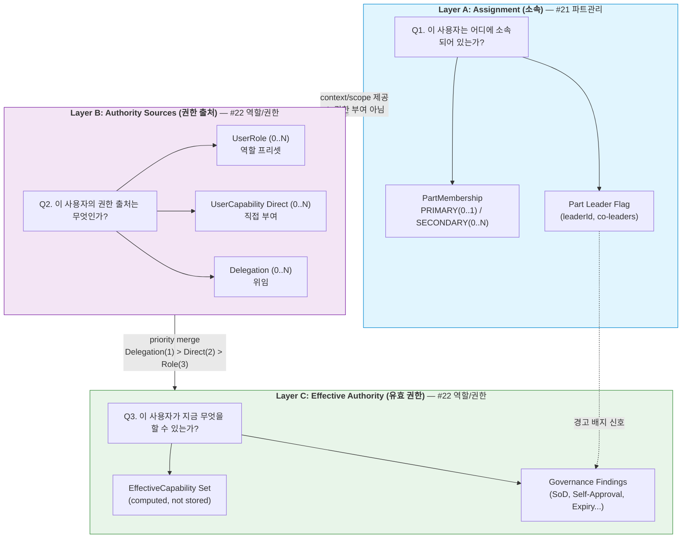
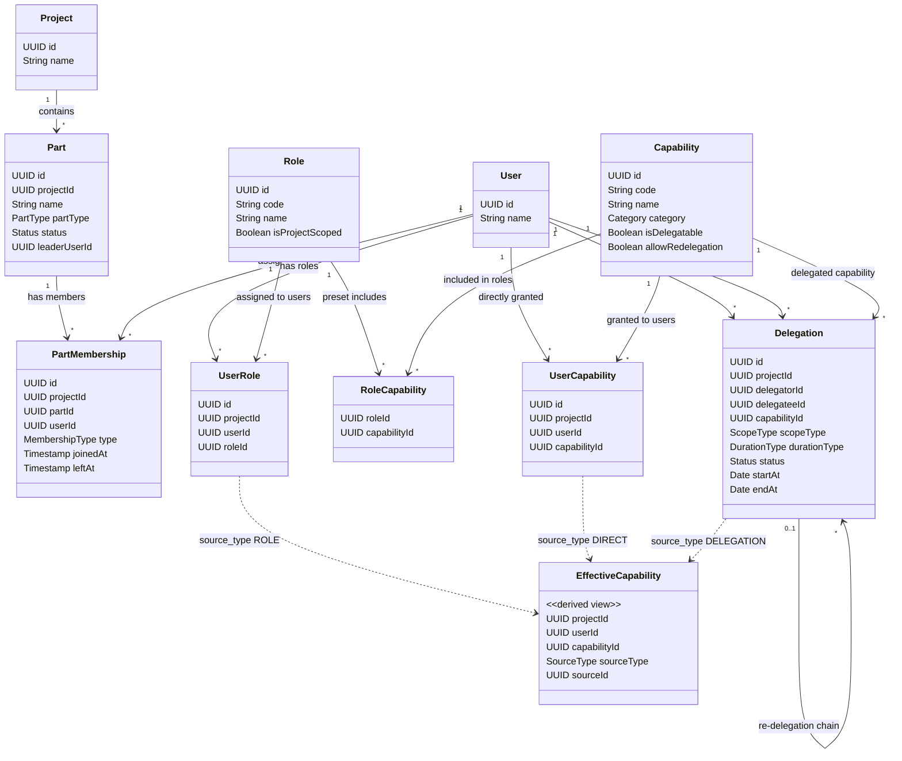
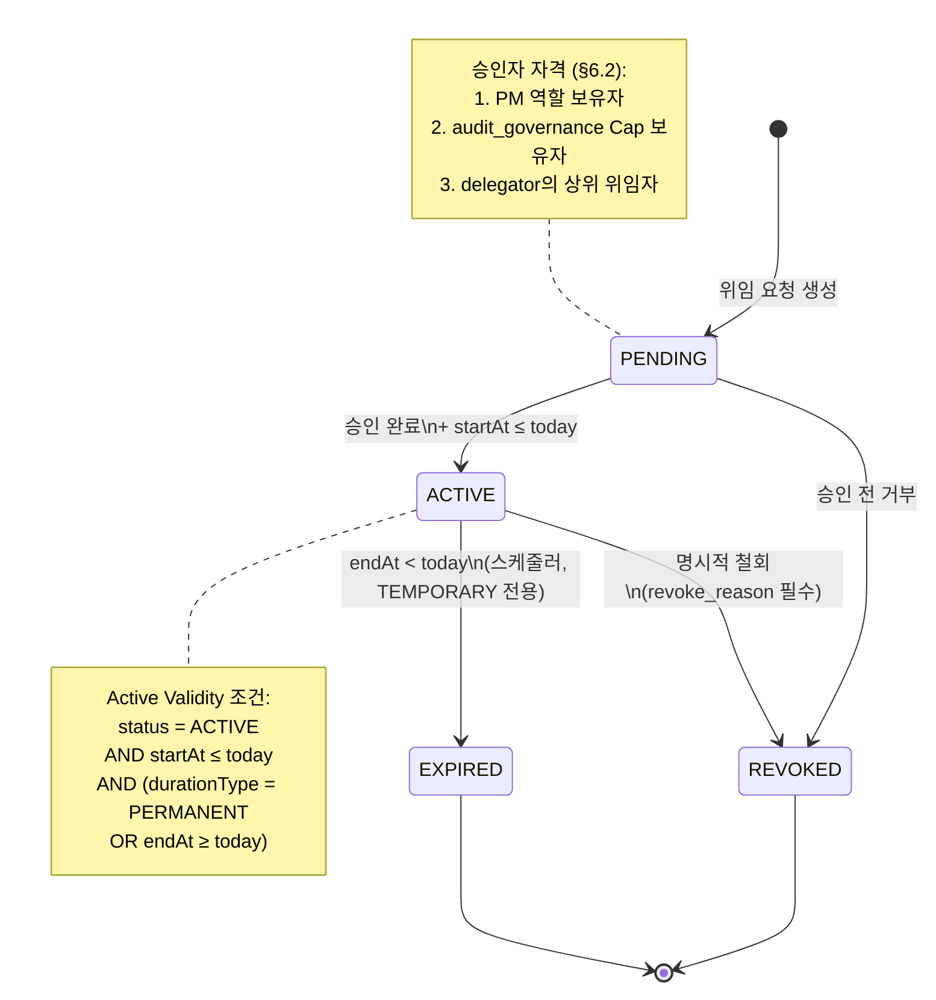
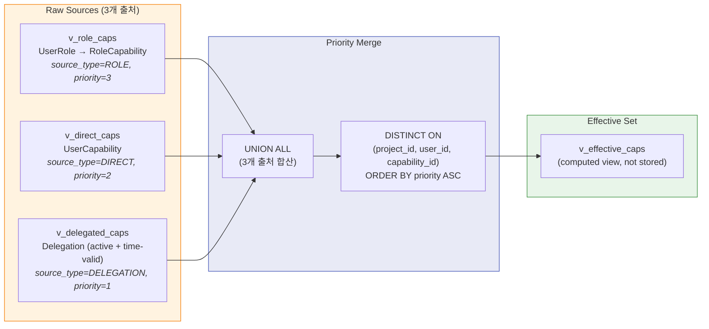
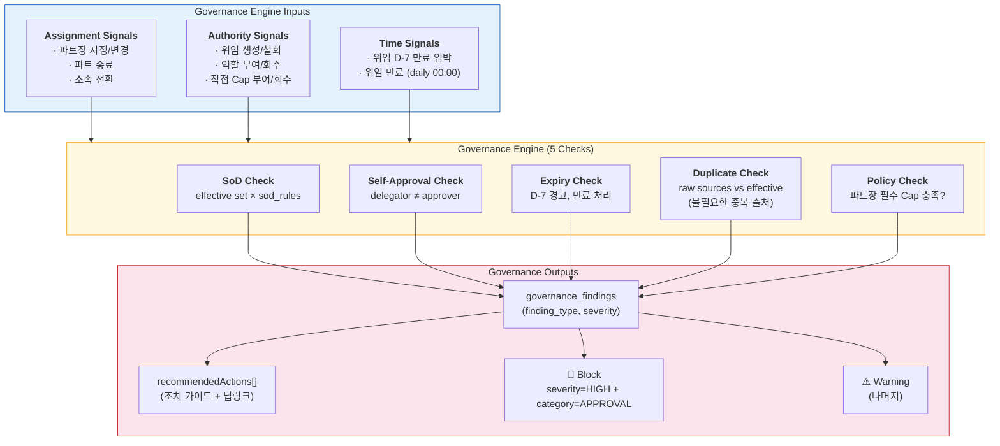

# 22. 역할 및 권한 관리 화면설계 (위임/통제 허브 / Authority Orchestration)

> 작성일: 2026-02-09
> 버전: v1.2
> 라우트: `/role-permission`
> 필요 Capability: `view_role_permission`, `manage_roles`, `manage_capabilities`, `manage_delegations`, `audit_governance`
> 기본 Preset: `PM_WORK`
> 노드 역할: **Action** (액션 노드 — 권한 생성·이동·소멸의 유일한 장소)
> DB 설계: [20_22_DB설계_권한거버넌스.md §3-§4](20_22_DB설계_권한거버넌스.md) (Postgres `governance` schema + Effective Capability Views)

---

### v1.0 → v1.1 변경 이력

| 항목 | v1.0 | v1.1 | 변경 사유 |
|------|------|------|----------|
| Effective Capability 우선순위 | 미정의 | §4.7 신설: Delegation > Direct > RolePreset | 동일 Capability가 복수 경로로 부여될 때 적용 우선순위 명확화 |
| 재위임(Re-delegation) | 미정의 | §4.3 `allowRedelegation` 속성 추가, 기본 false | 위임 체인 무한 확장 방지 |
| FUNCTION scope 제약 | FUNCTION 선택만 가능 | §4.5 TEMPORARY 전용 + functionDescription 필수 + PM/audit_governance 승인 필수 | 가장 좁은 범위이므로 가장 엄격한 통제 적용 |
| SoD 위반 시 동작 | 모든 SoD → 경고만 | §8.2 severity=HIGH AND category=APPROVAL → **차단**, 나머지 → 경고 | 승인 계열 SoD 위반은 내부 통제상 차단이 필수 |
| 위임 승인자 자격 | "PM 또는 상위 권한자" (구두 기술) | §6.2 자격 조건 3가지 정형화 | 승인자 자격을 시스템이 검증할 수 있도록 정형화 |
| PM 부재 시 위임 맵 루트 | 미정의 | §5.2 PM 대행 루트 전환 규칙 추가 | PM 부재 기간 위임 맵 가시성 유지 |
| delegation-map API | effectiveCapabilities 미포함 | §10.1 `?includeEffectiveCapabilities=true` 쿼리 파라미터 추가 | 위임 맵에서 각 노드별 유효 권한을 한 번에 조회 |
| governance/check API | 위반 목록만 반환 | §10.6 `recommendedActions[]` 배열 추가 | 위반 발견 시 조치 가이드를 UI에서 바로 제시 |
| 통합 상태 모델 | 미정의 | §4.9 신설: 3-Layer 통합 모델(User 360, Delegation/Membership State Machine, Effective Capability Priority, Governance Engine, Dual-DB) | #21과의 Layer A↔B↔C 경계 명확화, 상태 머신 다이어그램, 거버넌스 엔진 모델 |

---

## 1. 화면 개요

### 1.1 목적

이 화면은 단순한 설정 페이지가 아니다.

> **"권한이 생성되고, 이동하고, 소멸되는 유일한 장소"**

여기서만:
- 역할이 부여되고
- 권한이 위임되고
- 통제가 이루어진다

이 메뉴는 **'권한 흐름을 설계하는 관제실(Authority Orchestration Center)'**이다.

### 1.2 핵심 개념 분리

> **가장 중요한 원칙**: Role, Capability, Delegation은 **절대 섞이면 안 된다.**
> UI에서도 시각적으로 분리하여 표현해야 한다.

| 개념 | 의미 | 비유 |
|------|------|------|
| **Assignment** | 소속 (파트) — 이 화면에서 다루지 않음 | "어디에 앉아있는가" |
| **Role** | 직무적 책임 (PM, QA Lead, Dev...) | "무슨 직책인가" |
| **Capability** | 실제 시스템 권한 (승인, 편집, 삭제...) | "무엇을 할 수 있는가" |
| **Delegation** | 권한을 넘긴 행위 | "누가 이 힘을 줬는가" |

```
Role ≠ Capability ≠ Delegation

Role은 "직책"이다.
Capability는 "실제 힘"이다.
Delegation은 "힘의 이동 경로"이다.

세 가지를 UI에서 반드시 분리해서 보여줘야 한다.
```

### 1.3 설계 원칙

| 원칙 | 설명 |
|------|------|
| **유일한 권한 관리 장소** | 시스템 전체에서 권한이 변경되는 곳은 이 화면뿐 |
| **개념 분리** | Role / Capability / Delegation을 시각적으로 분리 |
| **위임 추적** | 모든 위임은 "누가, 왜, 언제까지"가 기록됨 |
| **거버넌스 검증** | SoD 위반, 자기 승인, 만료 임박 등 위험 자동 검출 |
| **위임 맵 시각화** | 권한 흐름을 트리/그래프 형태로 한눈에 표시 |
| **조직 불간섭** | 소속(파트) 편집, 프로젝트 생성/삭제는 이 화면에서 불가 |
| **Effective Capability 우선순위** | Delegation > Direct > RolePreset (v1.1) |
| **SoD 차단/경고 이원화** | HIGH+APPROVAL → 차단, 나머지 → 경고 (v1.1) |

### 1.4 핵심 질문 → 화면 요소 매핑

| 사용자 질문 | 화면 요소 | 동작 |
|-----------|----------|------|
| "이 사람 역할이 뭐야?" | 사용자 상세 패널 | 역할 표시 |
| "누가 테스트 승인 권한 있어?" | Capability 검색 | 해당 권한 보유자 목록 |
| "이 권한은 누가 줬어?" | 위임 상세 | 위임자·승인자·기간 표시 |
| "권한 위임 현황 보여줘" | 위임 맵 | 트리 형태 시각화 |
| "SoD 위반 있어?" | 거버넌스 검증 패널 | 위반 목록 + 상세 |
| "만료 예정 위임 있어?" | 거버넌스 검증 패널 | D-day 기반 목록 |
| "권한을 위임하고 싶어" | 위임 생성 | 위임 생성 폼 |
| "역할을 부여하고 싶어" | 역할 부여 | 역할 부여 폼 |
| "위임 맵 전체 보여줘" | 위임 맵 (전체 확장) | PM 기점 트리 전개 |
| "이 사람의 유효 권한이 뭐야?" | 사용자 상세 패널 | Effective Capability 목록 (v1.1) |
| "재위임할 수 있어?" | 위임 생성 모달 | 재위임 가능 여부 표시 (v1.1) |

---

## 2. MenuOntology 노드

### 2.1 타입 확정

| 항목 | 값 | 비고 |
|------|-----|------|
| `nodeId` | `role-permission` | 단일 노드 |
| `domain` | `"governance"` | 거버넌스 도메인 |
| `nodeRole` | `"action"` | 권한 관리 (행동 질문에 +10 가산) |
| `entities` | `"Role"`, `"Capability"`, `"Delegation"`, `"User"` | 관련 엔티티 |
| `requiredCaps` | `["view_role_permission"]` | 조회 최소 권한 |
| `editCaps` | `["manage_roles", "manage_capabilities", "manage_delegations"]` | 편집 권한 |
| `auditCaps` | `["audit_governance"]` | 거버넌스 검증 조회 |

### 2.2 MenuOntologyNode 정의

```typescript
const rolePermissionNode: MenuOntologyNode = {
  nodeId: "role-permission",
  label: "역할 및 권한 관리",
  route: "/role-permission",
  icon: "ShieldCheck",
  domain: "governance",
  nodeRole: "action",
  entities: ["Role", "Capability", "Delegation", "User"],
  requiredCaps: ["view_role_permission"],

  intents: [
    "role_management",         // 역할 부여/해제
    "capability_check",        // 권한 확인
    "delegation_management",   // 위임 생성/수정/해지
    "delegation_map",          // 위임 맵 조회
    "governance_audit",        // SoD/만료/자기승인 검증
    "authority_flow",          // 권한 흐름 추적
    "effective_capability",    // 유효 권한 조회 (v1.1)
  ],

  keywords: [
    "역할", "권한", "위임", "Capability", "Delegation",
    "SoD", "승인", "자기승인", "권한 부여", "역할 부여",
    "위임 맵", "권한 이전", "만료", "거버넌스",
    "권한 위임", "승인 권한", "코드 승인", "테스트 승인",
    "유효 권한", "재위임", "PM 대행",
  ],

  scopeKeys: ["project", "part", "user"],

  suggestedActions: [
    {
      actionId: "grant-role",
      label: "역할 부여",
      requiredCaps: ["manage_roles"],
      route: "/role-permission",
    },
    {
      actionId: "create-delegation",
      label: "권한 위임 생성",
      requiredCaps: ["manage_delegations"],
      route: "/role-permission",
    },
    {
      actionId: "view-delegation-map",
      label: "위임 맵 보기",
      requiredCaps: ["view_role_permission"],
      route: "/role-permission",
    },
    {
      actionId: "check-governance",
      label: "거버넌스 검증",
      requiredCaps: ["audit_governance"],
      route: "/role-permission",
    },
  ],

  deepLinks: {
    patterns: [
      "/role-permission/:tab",
      "/role-permission/user/:userId",
      "/role-permission/delegation/:delegationId",
      "/role-permission/user/:userId/effective-capabilities",  // v1.1
    ],
  },
};
```

---

## 3. 허용/금지 행위 매트릭스

### 3.1 허용 행위 (Do)

| 행위 | 상세 | 필요 Capability |
|------|------|----------------|
| 역할 부여 | 사용자에게 프로젝트 역할 지정 | `manage_roles` |
| 역할 해제 | 사용자에서 프로젝트 역할 제거 | `manage_roles` |
| 역할별 Preset Capability 조회 | 역할에 포함된 기본 Capability 목록 확인 | `view_role_permission` |
| 개별 Capability 부여 | 사용자에게 추가 Capability 직접 부여 | `manage_capabilities` |
| 개별 Capability 회수 | 사용자에서 Capability 제거 | `manage_capabilities` |
| 권한 위임 생성 | 위임자 → 수임자 권한 이동 기록 생성 | `manage_delegations` |
| 권한 위임 수정 | 위임 범위/기간 변경 | `manage_delegations` |
| 권한 위임 해지 | 위임 종료 | `manage_delegations` |
| 위임 맵 조회 | 프로젝트 전체 위임 흐름 트리 시각화 | `view_role_permission` |
| 사용자 권한 상세 조회 | 특정 사용자의 역할 + Capability + 위임 전체 조회 | `view_role_permission` |
| 유효 권한(Effective Cap) 조회 | 사용자별 우선순위 적용된 최종 권한 목록 (v1.1) | `view_role_permission` |
| 거버넌스 검증 조회 | SoD 위반, 자기승인, 만료 임박 감사 | `audit_governance` |

### 3.2 금지 행위 (Do Not)

| 금지 항목 | 사유 | 대신 사용할 메뉴 |
|----------|------|----------------|
| 조직 구조 편집 (파트 생성/수정) | 소속은 파트 관리의 책임 | 파트 관리 |
| 사용자 소속 변경 | 소속은 파트 관리의 책임 | 파트 관리 |
| 프로젝트 생성/삭제 | 프로젝트 관리의 책임 | 프로젝트 관리 / 관리자 |
| PM 변경 | 책임 주체는 프로젝트 관리의 책임 | 프로젝트 관리 |
| 단순 인원 나열 | 인원 목록은 파트 관리에서 | 파트 관리 |

---

## 4. 핵심 엔티티 & 데이터 모델

### 4.1 관련 엔티티

```
User ──M:N──▶ Role (via UserRole)
Role ──1:N──▶ RoleCapability ──N:1──▶ Capability
User ──0:N──▶ UserCapability ──N:1──▶ Capability (직접 부여)
User ──0:N──▶ Delegation (as delegator or delegatee)
Delegation ──1:1──▶ Capability
Delegation ──0:1──▶ User (approver)
```

### 4.2 역할 (Role)

```typescript
interface Role {
  id: string;
  name: string;
  code: RoleCode;
  description: string;
  /** 이 역할에 기본 포함된 Capability 목록 */
  presetCapabilities: Capability[];
  /** 프로젝트 범위 역할 여부 */
  isProjectScoped: boolean;
}

type RoleCode =
  | "PM"
  | "CO_PM"
  | "PMO_HEAD"
  | "PMO_MEMBER"
  | "SPONSOR"
  | "PART_LEADER"
  | "DEV_LEAD"
  | "QA_LEAD"
  | "DEVELOPER"
  | "QA_ENGINEER"
  | "BUSINESS_ANALYST"
  | "MEMBER";
```

### 4.3 Capability (실제 권한) — v1.1 업데이트

```typescript
interface Capability {
  id: string;
  code: string;
  name: string;
  category: CapabilityCategory;
  description: string;
  /** 위임 가능 여부 */
  isDelegatable: boolean;
  /**
   * 재위임(re-delegation) 허용 여부 (v1.1)
   * - true: 위임받은 사용자가 다시 다른 사용자에게 위임 가능
   * - false (기본값): 위임받은 권한은 재위임 불가
   * - 재위임 시 PM 승인 필수
   */
  allowRedelegation: boolean;  // default: false
  /** SoD 충돌 대상 Capability */
  sodConflicts?: string[];
}

type CapabilityCategory =
  | "APPROVAL"       // 승인 권한 (코드 승인, 테스트 승인, 산출물 승인 등)
  | "MANAGEMENT"     // 관리 권한 (생성, 수정, 삭제)
  | "VIEW"           // 조회 권한
  | "EXECUTION"      // 실행 권한 (배포, 테스트 실행 등)
  | "GOVERNANCE";    // 거버넌스 권한 (감사, 검증)
```

#### 4.3.1 재위임(Re-delegation) 규칙 (v1.1)

| 규칙 | 설명 |
|------|------|
| 기본값 | `allowRedelegation = false` — 위임받은 권한은 재위임 불가 |
| 재위임 조건 | `allowRedelegation = true`인 Capability만 재위임 가능 |
| 승인 요건 | 재위임 시 반드시 **PM 승인** 필수 (일반 위임보다 엄격) |
| 체인 깊이 | 최대 2단계까지만 허용 (A→B→C, A→B→C→D는 불가) |
| 출처 표시 | UI에서 "원 위임자 → 중간 위임자 → 최종 수임자" 체인 표시 |
| 해지 연쇄 | 원 위임이 해지되면 하위 재위임도 자동 해지 (cascade revoke) |

```
재위임 검증 프로세스:
┌─────────────────────────────┐
│ ① Capability.allowRedelegation │──── false → 차단: "이 권한은 재위임 불가"
│    == true?                    │
└────────────────────────────────┘
    │ true
    ▼
┌─────────────────────────────┐
│ ② 현재 체인 깊이 < 2?        │──── ≥ 2 → 차단: "재위임 깊이 초과"
└─────────────────────────────┘
    │ < 2
    ▼
┌─────────────────────────────┐
│ ③ 승인자 = PM Role 보유자?   │──── 아니오 → 차단: "재위임은 PM 승인 필수"
└─────────────────────────────┘
    │ 예
    ▼
  재위임 생성 허용
```

### 4.4 사용자 역할 할당 (UserRole)

```typescript
interface UserRole {
  id: string;
  projectId: string;
  userId: string;
  roleId: string;
  grantedBy: string;        // 부여자
  grantedAt: string;        // 부여 시점
  reason?: string;           // 부여 사유
}
```

### 4.5 권한 위임 (Delegation) — 핵심 엔티티, v1.1 업데이트

```typescript
interface Delegation {
  id: string;
  projectId: string;

  /** 위임 관계 */
  delegatorId: string;       // 위임자 (권한을 넘기는 사람)
  delegatorName: string;
  delegateeId: string;       // 수임자 (권한을 받는 사람)
  delegateeName: string;

  /** 위임 대상 */
  capabilityId: string;      // 위임하는 Capability
  capabilityCode: string;
  capabilityName: string;

  /** 위임 범위 */
  scope: DelegationScope;

  /** 위임 기간 */
  durationType: "PERMANENT" | "TEMPORARY";
  startDate: string;         // 시작일
  endDate?: string;          // 종료일 (TEMPORARY일 때 필수)

  /** 승인 정보 */
  approverId: string;        // 승인자 (위임을 승인한 사람)
  approverName: string;
  approvedAt: string;

  /** 상태 */
  status: DelegationStatus;
  createdAt: string;
  revokedAt?: string;
  revokedBy?: string;
  revokeReason?: string;

  /**
   * 재위임 출처 (v1.1)
   * - null: 원 위임 (직접 위임)
   * - delegationId: 이 위임의 원본이 된 상위 위임 ID
   */
  parentDelegationId?: string | null;
}

interface DelegationScope {
  type: "PROJECT" | "PART" | "FUNCTION";
  /** PART scope일 때 대상 파트 ID */
  partId?: string;
  partName?: string;
  /**
   * FUNCTION scope일 때 기능 설명 (v1.1: FUNCTION에서는 필수)
   * - FUNCTION scope는 TEMPORARY만 허용
   * - PM 또는 audit_governance Cap 보유자 승인 필수
   */
  functionDescription?: string;
}

type DelegationStatus =
  | "ACTIVE"       // 활성
  | "EXPIRED"      // 기간 만료
  | "REVOKED"      // 해지됨
  | "PENDING";     // 승인 대기
```

#### 4.5.1 FUNCTION Scope 제약 규칙 (v1.1)

> FUNCTION은 가장 좁은 범위이므로 가장 엄격한 통제를 적용한다.

| 제약 | 설명 |
|------|------|
| **TEMPORARY 전용** | FUNCTION scope에서 `durationType: "PERMANENT"`는 불가 |
| **functionDescription 필수** | 빈 값이면 생성 차단 |
| **승인자 자격 강화** | PM Role 보유자 **또는** `audit_governance` Capability 보유자만 승인 가능 |
| **최대 기간** | 90일 이내 (초과 시 재생성 필요) |
| **알림** | 생성 시 PM에게 별도 알림 발송 |

```
FUNCTION scope 검증:
┌──────────────────────────┐
│ durationType == PERMANENT? │──── 예 → 차단: "FUNCTION은 TEMPORARY만 가능"
└──────────────────────────┘
    │ TEMPORARY
    ▼
┌──────────────────────────┐
│ functionDescription 있음?  │──── 없음 → 차단: "기능 설명 필수"
└──────────────────────────┘
    │ 있음
    ▼
┌──────────────────────────┐
│ endDate - startDate ≤ 90일? │──── 초과 → 차단: "최대 90일"
└──────────────────────────┘
    │ ≤ 90일
    ▼
┌──────────────────────────────┐
│ 승인자 = PM Role              │
│   OR audit_governance Cap?   │──── 아니오 → 차단: "PM 또는 감사 권한자만 승인 가능"
└──────────────────────────────┘
    │ 예
    ▼
  FUNCTION 위임 생성 허용
```

### 4.6 거버넌스 검증 결과 (GovernanceCheck) — v1.1 업데이트

```typescript
interface GovernanceCheckResult {
  projectId: string;
  checkedAt: string;

  /** SoD 위반 */
  sodViolations: SodViolation[];

  /** 자기 승인 감지 */
  selfApprovals: SelfApproval[];

  /** 만료 임박/만료 위임 */
  expiringDelegations: ExpiringDelegation[];

  /** 중복 권한 */
  duplicateCapabilities: DuplicateCapability[];

  /**
   * 권장 조치 목록 (v1.1)
   * - 각 위반 항목에 대한 구체적 해결 가이드
   * - UI에서 "원클릭 조치" deep link 제공
   */
  recommendedActions: RecommendedAction[];
}

interface SodViolation {
  userId: string;
  userName: string;
  conflictingCapabilities: [string, string]; // 충돌하는 두 Capability
  conflictingCapabilityNames: [string, string]; // (v1.1) 표시용 이름
  description: string;                       // "동일 사용자가 '요청'과 '승인' 권한 보유"
  severity: "HIGH" | "MEDIUM" | "LOW";
  /** v1.1: 차단 여부 — severity=HIGH AND category=APPROVAL이면 true */
  blocked: boolean;
}

interface SelfApproval {
  userId: string;
  userName: string;
  capabilityCode: string;
  description: string;
}

interface ExpiringDelegation {
  delegationId: string;
  delegateeName: string;
  capabilityName: string;
  endDate: string;
  daysRemaining: number;
  status: "EXPIRING_SOON" | "EXPIRED";       // EXPIRING_SOON: D-7 이내
}

interface DuplicateCapability {
  userId: string;
  userName: string;
  capabilityCode: string;
  sources: string[];                          // "Role: QA Lead" | "Delegation from 박OO"
}

/**
 * v1.1: 권장 조치 (Recommended Action)
 * - 거버넌스 검증 결과에서 발견된 위반에 대한 구체적 해결 가이드
 */
interface RecommendedAction {
  /** 관련 위반 항목 ID (sodViolation, selfApproval 등의 참조 인덱스) */
  referenceType: "SOD_VIOLATION" | "SELF_APPROVAL" | "EXPIRING_DELEGATION" | "DUPLICATE_CAPABILITY";
  referenceIndex: number;

  /** 조치 유형 */
  actionType: "REVOKE_CAPABILITY" | "REVOKE_DELEGATION" | "TRANSFER_DELEGATION"
            | "EXTEND_DELEGATION" | "CHANGE_APPROVER" | "REMOVE_DUPLICATE";

  /** 사람이 읽을 수 있는 설명 */
  description: string;

  /** 우선순위 */
  priority: "CRITICAL" | "HIGH" | "MEDIUM" | "LOW";

  /** 조치를 수행할 deep link */
  deepLink?: string;

  /** 조치 대상 사용자 */
  targetUserId?: string;
  targetUserName?: string;

  /** 조치 대상 Capability/Delegation */
  targetCapabilityCode?: string;
  targetDelegationId?: string;
}
```

### 4.7 유효 권한 우선순위 (Effective Capability Priority) — v1.1 신설

> **핵심 규칙**: 동일한 Capability가 복수 경로로 사용자에게 부여된 경우, 아래 우선순위를 따른다.

```
우선순위 (높은 순):
  1. Delegation (위임)
  2. Direct UserCapability (직접 부여)
  3. Role Preset Capability (역할 기본 포함)
```

| 우선순위 | 출처 | 의미 | 적용 규칙 |
|---------|------|------|----------|
| **1 (최우선)** | Delegation | 명시적 위임 | 위임자·승인자·기간·범위가 명확 → 가장 구체적인 권한 부여 |
| **2** | Direct (UserCapability) | 관리자가 직접 부여 | Role 없이도 부여 가능한 ad-hoc 권한 |
| **3 (최저)** | Role Preset | 역할에 기본 포함 | 역할 해제 시 자동 소멸 |

#### 4.7.1 우선순위 적용 시나리오

```
시나리오: 김OO가 "approve_code" 권한을 3가지 경로로 보유

  경로 1: Role(DEV_LEAD) Preset → approve_code       ... Priority 3
  경로 2: Direct UserCapability → approve_code         ... Priority 2
  경로 3: Delegation from 박OO → approve_code (AI파트)  ... Priority 1

표시 방법 (Effective Capability 패널):
  ┌────────────────────────────────────────────────┐
  │  approve_code (코드 승인)                        │
  │                                                │
  │  ★ 유효 출처: 위임 (from 박OO, AI 개발 파트)      │  ← Priority 1
  │    · 직접 부여 (2025-11-01)                      │  ← Priority 2
  │    · 역할 기본 포함 (DEV_LEAD)                    │  ← Priority 3
  │                                                │
  │  범위: AI 개발 파트 (위임 범위 적용)               │
  └────────────────────────────────────────────────┘
```

#### 4.7.2 우선순위가 영향을 미치는 항목

| 항목 | 영향 |
|------|------|
| **권한 범위(scope)** | Delegation의 scope가 있으면 해당 scope 적용 (PROJECT/PART/FUNCTION) |
| **해지 시 잔여 확인** | Delegation 해지 시 Direct/RolePreset 잔여 확인 → 권한 유지 여부 판단 |
| **감사 로그** | Effective 출처 기준으로 "이 승인은 어떤 근거로 이루어졌는가" 추적 |
| **SoD 검증** | 모든 경로(세 가지 모두) 합산하여 SoD 검증 수행 |
| **거버넌스 검증 중복 권한** | 우선순위 차이로 동일 Cap가 복수 경로로 존재하면 `DuplicateCapability`로 보고 |

### 4.8 DB 스키마 매핑

> 상세 DDL/인덱스/뷰는 [20_22_DB설계_권한거버넌스.md](20_22_DB설계_권한거버넌스.md) 참조.

| TypeScript 엔티티 | Postgres 테이블 | Schema | 비고 |
|-------------------|----------------|--------|------|
| `Role` | `governance.roles` | governance | `uq_roles_scope_code`로 scope별 code 유일성 보장 |
| `Capability` | `governance.capabilities` | governance | `code UNIQUE`, `allow_redelegation` 속성 포함 |
| (Role↔Capability) | `governance.role_capabilities` | governance | M:N 매핑 (Role Preset) |
| `UserRole` | `governance.user_roles` | governance | 역할 부여 기록 |
| (Direct Cap) | `governance.user_capabilities` | governance | `uq_user_cap_project_user_cap`로 중복 직접 부여 방지 |
| `Delegation` | `governance.delegations` | governance | 핵심 엔티티 — 6개 CHECK 제약 (§3.6 참조) |
| `GovernanceCheckResult` | `governance.governance_check_runs` + `governance.governance_findings` | governance | 검증 실행 + 개별 findings |
| `SodViolation` (규칙) | `governance.sod_rules` | governance | `uq_sod_pair`로 방향 무관 유일 쌍 보장 |
| (감사 로그) | `governance.permission_audit_log` | governance | 불변 append-only |
| (Outbox) | `governance.outbox_events` | governance | Postgres→Neo4j 동기화 |

**Effective Capability Views (계산, 저장하지 않음):**

| View | 출처 | 우선순위 |
|------|------|---------|
| `governance.v_role_caps` | `user_roles` JOIN `role_capabilities` | 3 (최저) |
| `governance.v_direct_caps` | `user_capabilities` | 2 |
| `governance.v_delegated_caps` | `delegations` (status=ACTIVE + 기간 유효) | 1 (최우선) |
| `governance.v_effective_caps` | 위 3개 UNION ALL + `DISTINCT ON` 우선순위 적용 | 최종 유효 |

**핵심 DB 레벨 보장:**

- **Self-approval 차단**: `chk_no_self_approval` CHECK — `approver_id <> delegator_id`
- **TEMPORARY 종료일 필수**: `chk_temp_end_required` CHECK — TEMPORARY이면 `end_at IS NOT NULL`
- **PART scope FK**: `chk_scope_part_required` CHECK + `scope_part_id` FK
- **FUNCTION scope 설명 필수**: `chk_scope_function_required` CHECK
- **SoD 쌍 유일성**: `uq_sod_pair` — `LEAST/GREATEST`로 방향 무관 유일 보장
- **Re-delegation chain**: `parent_delegation_id` self-FK + `idx_delegations_parent` 인덱스

**서비스 레이어 검증 (DB 제약 불가):**

- FUNCTION scope = TEMPORARY only + max 90 days
- Re-delegation depth max 2
- Re-delegation requires PM approval
- Cascade revoke on parent delegation revocation
- SoD blocking (severity=HIGH + category=APPROVAL)
- Delegation expiration scheduler (daily 00:00 KST)

**Neo4j 활용:**

- 위임 맵 (Tab 1): `MATCH (pm)-[:DELEGATED*0..5]->(u)` 트리 탐색
- PM 대행 루트 전환: `:PRIMARY_PM_OF` 관계 기반
- 영향 분석: 그래프 경로 탐색으로 cascade 범위 사전 파악

---

## 4.9 통합 상태 모델 (3-Layer Integrated State Model)

> **v1.2 신설** — #21(Assignment)과 #22(Authority)를 하나의 일관된 모델로 통합한다.
> Layer A는 [21_파트관리_화면설계.md §4.7](21_파트관리_화면설계.md)에서 상세 정의하며,
> 이 절은 Layer B(Authority Sources), Layer C(Effective Authority), 그리고 전체 3-Layer 통합 뷰를 정의한다.

### 4.9.1 User 360 State Model (3-Layer 개념 모델)

사용자의 전체 상태는 3개의 고정된 질문으로 설명된다:



**핵심 연결 규칙:**

| 규칙 | 설명 |
|------|------|
| Assignment ≠ Authority | Layer A(소속)는 권한을 부여하지 않음 — 컨텍스트/스코프만 제공 |
| 파트장 배지 = 거버넌스 경고 | 파트장의 경고 배지는 Governance Findings로 연결되며, 권한 부여가 아님 |
| Effective = Computed | Layer C의 유효 권한은 저장하지 않고 3개 출처에서 우선순위 기반 계산 |
| Layer 경계 = 화면 경계 | Layer A → #21 화면, Layer B+C → #22 화면 (명확한 책임 분리) |

### 4.9.2 통합 Entity Relationship Diagram



**Layer 매핑:**

| Entity | Layer | DB Schema | 화면 |
|--------|-------|-----------|------|
| Part, PartMembership | A (Assignment) | `organization.*` | #21 |
| Role, Capability, UserRole, RoleCapability, UserCapability | B (Authority Sources) | `governance.*` | #22 Tab 2 |
| Delegation | B (Authority Sources) | `governance.delegations` | #22 Tab 1 |
| EffectiveCapability (view) | C (Effective) | `governance.v_effective_caps` | #22 Tab 1/2 |
| GovernanceFindings | C (Effective) | `governance.governance_findings` | #22 Tab 3 |

### 4.9.3 Delegation State Machine



**상태 전이 규칙:**

| 전이 | 조건 | 사후 동작 |
|------|------|----------|
| `[*] → PENDING` | 위임 요청 생성 (delegator, delegatee, capability, scope 지정) | 승인자에게 알림 전송 |
| `PENDING → ACTIVE` | 승인자가 승인 + `startAt ≤ today` | SoD 검증 실행, Outbox 이벤트 발행 |
| `PENDING → REVOKED` | 승인 전 거부 또는 요청 취소 | Audit log 기록 |
| `ACTIVE → REVOKED` | 명시적 철회 (`revoke_reason` 필수) | **Cascade**: 자식 re-delegation도 함께 철회, Outbox 이벤트 |
| `ACTIVE → EXPIRED` | 스케줄러 (매일 00:00 KST), `TEMPORARY` 전용 | **Cascade**: 자식 re-delegation도 함께 만료, Outbox 이벤트 |

**Time-Aware Active 판정 (SQL):**

```sql
-- Delegation이 "현재 유효한가?" 판정
WHERE status = 'ACTIVE'
  AND start_at <= current_date
  AND (duration_type = 'PERMANENT' OR end_at >= current_date)
```

**Re-delegation 제약:**

| 제약 | 규칙 | 근거 |
|------|------|------|
| 허용 여부 | `capabilities.allow_redelegation = true`일 때만 | 위임 체인 무한 확장 방지 |
| 최대 깊이 | 2단계까지 (원위임 → 재위임1 → 재위임2) | 추적 가능성 보장 |
| PM 승인 필수 | 모든 re-delegation은 PM 역할 보유자 승인 필요 | 통제 강화 |
| Cascade 철회 | 부모 위임 철회/만료 → 자식 위임도 자동 철회/만료 | 고아 위임 방지 |

### 4.9.4 Effective Capability Calculation (우선순위 기반 계산)



**우선순위 규칙:**

| 우선순위 | Source Type | 의미 | 예시 |
|---------|-----------|------|------|
| 1 (최우선) | `DELEGATION` | 위임받은 권한 | PM이 개발리드에게 `approve_code` 위임 |
| 2 | `DIRECT` | 직접 부여된 권한 | 사용자에게 직접 `manage_sprint` 부여 |
| 3 (최후) | `ROLE` | 역할 프리셋에 포함된 권한 | `PM` 역할의 기본 권한 세트 |

**동일 Capability가 복수 경로로 존재할 때**: 가장 높은 우선순위 출처 1개만 유효 권한으로 채택.
이는 위임 철회 시 Direct/Role 출처가 자동으로 "복원"되는 효과를 만든다.

**SQL 구현**: [20_22_DB설계_권한거버넌스.md §4.4](20_22_DB설계_권한거버넌스.md) `v_effective_caps` 뷰 참조

### 4.9.5 Governance Engine Model

거버넌스 엔진은 3종류의 신호를 수신하여 5가지 검증을 실행하고,
Findings(위반/경고)와 추천 조치를 생성한다.



**SoD Dual Enforcement (v1.1 확정):**

| 조건 | 동작 | 근거 |
|------|------|------|
| `severity=HIGH` AND `category=APPROVAL` | **차단** (위임/권한 부여 거부) | 승인 계열 SoD 위반은 내부 통제상 차단 필수 |
| 그 외 | **경고** (Findings에 기록, UI 표시) | 운영 유연성 유지 |

**Governance Check 트리거:**

| 트리거 | 실행 시점 | 검증 항목 |
|--------|---------|----------|
| 위임 생성/승인 시 | Real-time (서비스 레이어) | SoD, Self-Approval |
| 역할/Cap 부여 시 | Real-time (서비스 레이어) | SoD, Duplicate |
| 매일 00:00 KST | 스케줄러 | Expiry (만료 처리 + D-7 경고) |
| 수동 실행 | Tab 3 "검증 실행" 버튼 | 전체 5종 검증 |
| 파트장 변경 시 | Outbox 이벤트 수신 | Policy (파트장 필수 Cap) |

### 4.9.6 Postgres vs Neo4j 역할 분담

```mermaid
flowchart LR
    subgraph PG["<b>Postgres (Single Source of Truth)</b>"]
        WRITE["All Writes<br/>(create/update/delete)"]
        FACT["Fact Storage<br/>(roles, caps, delegations...)"]
        CALC["Effective Capability<br/>Calculation (v_effective_caps)"]
        AUDIT["Audit Trail<br/>(permission_audit_log)"]
        SOD_V["SoD Validation<br/>(sod_rules × effective)"]
    end

    subgraph SYNC["Sync Layer"]
        OB["Outbox Events<br/>(governance.outbox_events)"]
        WORKER["Outbox Worker<br/>(poll + dispatch)"]
    end

    subgraph NEO["<b>Neo4j (Read-Only Projection)</b>"]
        DMAP["Delegation Map<br/>Tree Traversal<br/>(DELEGATED*0..5)"]
        VIS["Authority Flow<br/>Visualization"]
        IMPACT["Impact Analysis<br/>(cascade 범위 파악)"]
    end

    PG -->|"INSERT outbox_events<br/>(same TX)"| OB
    OB -->|"poll unprocessed"| WORKER
    WORKER -->|"idempotent MERGE"| NEO

    style PG fill:#e8f5e9,stroke:#2e7d32
    style SYNC fill:#fff3e0,stroke:#ef6c00
    style NEO fill:#e3f2fd,stroke:#1565c0
```



**역할 분담 규칙:**

| 구분 | Postgres | Neo4j |
|------|----------|-------|
| 쓰기 | **유일한 쓰기 대상** (SoT) | 쓰기 금지 (Projection Only) |
| 유효 권한 판정 | `v_effective_caps` view (정확도 보장) | 참조하지 않음 |
| SoD 검증 | `sod_rules` × `v_effective_caps` (차단 결정) | 참조하지 않음 |
| 위임 맵 시각화 | — | `MATCH path = (pm)-[:DELEGATED*0..5]->(u)` |
| 영향 분석 | — | 그래프 경로 탐색 (cascade 범위) |
| 감사 증적 | `permission_audit_log` (최종 근거) | — |
| 동기화 방식 | Outbox event 발행 (같은 TX) | Worker가 poll → idempotent MERGE |

> **Implementation Checkpoint**: Neo4j는 "truth" DB가 아니다.
> 유효 권한 판정과 감사 증적은 반드시 Postgres 결과 기반이어야 한다.
> Neo4j는 시각화와 그래프 탐색 전용이다.

### 4.9.7 #22 화면에 대한 통합 모델 적용

| 탭 | 통합 모델 구성요소 | 표시 데이터 |
|----|------------------|-----------|
| Tab 1: 위임 맵 | Delegation State Machine + Effective Calc | Neo4j 트리 + 각 노드별 effective caps (§10.1 `?includeEffectiveCapabilities=true`) |
| Tab 2: 역할/권한 | Layer B Sources (UserRole, UserCapability, RoleCapability) | Role 목록 + Cap 목록 + 사용자별 부여 현황 |
| Tab 3: 거버넌스 검증 | Governance Engine (5 checks) | Findings 목록 + severity 표시 + recommendedActions 딥링크 |
| 사용자 상세 패널 | User 360 (Layer B+C) | 해당 사용자의 역할/직접 부여/위임 출처 → effective 결과 |

---

## 5. 화면 레이아웃

### 5.1 전체 구조 — 3탭 구성

```
┌─────────────────────────────────────────────────────────────────┐
│  [Header] 역할 및 권한 관리                                       │
├─────────────────────────────────────────────────────────────────┤
│                                                                 │
│  [프로젝트 선택: AI 보험심사 처리 시스템 ▾]                        │
│                                                                 │
│  ┌──────────────┬──────────────┬──────────────┐                  │
│  │  위임 맵      │  역할/권한    │  거버넌스 검증 │                  │
│  └──────────────┴──────────────┴──────────────┘                  │
│                                                                 │
│  [각 탭별 콘텐츠 영역]                                            │
│                                                                 │
└─────────────────────────────────────────────────────────────────┘
```

### 5.2 탭 1: 위임 맵 (Delegation Map) — v1.1 PM 대행 루트 전환

```
┌─────────────────────────────────────────────────────────────────┐
│  위임 맵                                                         │
├───────────────────────────────────┬──────────────────────────────┤
│                                   │                              │
│  ┌─ PM (홍길동) ──────────────┐   │  사용자 상세                  │
│  │  [PM 부재 시: PM 대행 표시]  │   │                              │
│  │                            │   │  ┌────────────────────────┐  │
│  ├── 파트장(AI) 박OO          │   │  │  이OO                   │  │
│  │   │                        │   │  │                        │  │
│  │   ├── Dev Lead 김OO        │   │  │  소속:                  │  │
│  │   │   └─ (위임) 코드 승인   │   │  │    QA 파트              │  │
│  │   │                        │   │  │    → 파트 관리로 이동    │  │
│  │   └── QA Lead 이OO         │   │  │                        │  │
│  │       └─ (위임) 테스트 승인  │   │  │  역할:                  │  │
│  │                            │   │  │    QA Lead              │  │
│  └── 대행 PM 최OO             │   │  │                        │  │
│      (임시: 3/1~3/10)         │   │  │  유효 Capability:       │  │
│                               │   │  │    ★ 테스트 승인 (위임)  │  │
│  ⚠ SoD 충돌 1건               │   │  │    · 테스트 조회 (역할)  │  │
│  ⚠ 만료 예정 위임 2건          │   │  │    · 결함 관리 (역할)    │  │
│                               │   │  │                        │  │
│                               │   │  │  위임 정보:             │  │
│                               │   │  │    위임자: 박OO         │  │
│                               │   │  │    승인자: 홍길동        │  │
│                               │   │  │    기간: 2/20 ~ 3/10   │  │
│                               │   │  │    범위: AI 개발 파트    │  │
│                               │   │  │                        │  │
│                               │   │  │  [위임 해지]            │  │
│                               │   │  └────────────────────────┘  │
│                               │   │                              │
└───────────────────────────────┴───┴──────────────────────────────┘
```

#### PM 부재 시 위임 맵 루트 전환 규칙 (v1.1)

> PM이 부재(휴가, 출장 등) 상태에서 "PM 대행" 위임이 활성화되면, 위임 맵의 루트가 자동 전환된다.

| 상태 | 위임 맵 루트 | 표시 |
|------|------------|------|
| PM 정상 근무 | PM (홍길동) | 파란 원 (Crown) |
| PM 부재 + PM 대행 위임 활성 | **PM 대행 (최OO)** | 주황 원 (Crown + 시계) — "PM 대행 중 (3/1~3/10)" |
| PM 복귀 | PM (홍길동) | 자동 복귀 — PM 대행 위임은 기간 만료로 자동 종료 |

```
PM 부재 시 위임 맵 구조:

  ┌─ PM 대행 (최OO) ── [임시: 3/1~3/10] ──────┐
  │  (원 PM: 홍길동 — 부재 중)                   │
  │                                             │
  ├── 파트장(AI) 박OO                           │
  │   ├── Dev Lead 김OO                         │
  │   └── QA Lead 이OO                          │
  │                                             │
  └── 파트장(QA) 정OO                           │
      └── ...                                   │
```

**표시 규칙:**
- 원 PM은 위임 맵에서 회색 처리 (비활성) + "부재 중" 레이블
- PM 대행자가 루트 위치로 이동
- PM 복귀(= PM 대행 위임 만료/해지) 시 자동으로 원래 구조로 복원
- PM 대행 위임 종료 전까지는 PM 대행자가 모든 PM 권한을 행사

#### 위임 맵 노드 시각 규칙

| 노드 유형 | 아이콘/색상 | 설명 |
|----------|-----------|------|
| PM (Primary) | 파란 원 (Crown) | 책임의 출발점 |
| PM 대행 (v1.1) | 주황 원 (Crown + 시계) | PM 부재 시 임시 루트 |
| PM 부재 (v1.1) | 회색 원 (Crown, 흐림) | 부재 중인 원 PM |
| 파트장 | 초록 원 | 조직 관리자 |
| 역할 보유자 | 회색 원 | Role만 보유 |
| 위임 받은 사용자 | 주황 원 | Delegation 보유 |
| 임시 위임 | 점선 연결 | 기간 제한 위임 |
| 상시 위임 | 실선 연결 | 기간 무제한 위임 |
| 재위임 (v1.1) | 이중 점선 연결 | 재위임 경로 표시 |
| SoD 위반 | 빨간 테두리 | 충돌 Capability 보유 |
| SoD 차단 (v1.1) | 빨간 배경 + 자물쇠 | HIGH+APPROVAL 차단 대상 |
| 만료 임박 | 주황 깜빡임 | D-7 이내 만료 |

### 5.3 탭 2: 역할/권한 관리 (Role & Capability)

```
┌─────────────────────────────────────────────────────────────────┐
│  역할/권한 관리                                                   │
├─────────────────────────────────────────────────────────────────┤
│                                                                 │
│  ┌──────────────────────────────────────────────────┐            │
│  │  역할 부여                              [+ 부여]  │            │
│  │  ──────────────────────────────────────────────   │            │
│  │                                                   │            │
│  │  사용자       역할           부여자     부여일       │            │
│  │  ─────────────────────────────────────────────    │            │
│  │  홍길동      PM             시스템     2025.10.01  │            │
│  │  박OO        PART_LEADER   홍길동     2025.10.05  │            │
│  │  김OO        DEV_LEAD      박OO       2025.10.10  │            │
│  │  이OO        QA_LEAD       박OO       2025.10.10  │            │
│  │  최OO        DEVELOPER     홍길동     2025.11.01  │            │
│  │                                                   │            │
│  └──────────────────────────────────────────────────┘            │
│                                                                 │
│  ┌──────────────────────────────────────────────────┐            │
│  │  개별 Capability 부여                   [+ 부여]  │            │
│  │  ──────────────────────────────────────────────   │            │
│  │                                                   │            │
│  │  사용자       Capability     출처      부여일       │            │
│  │  ─────────────────────────────────────────────    │            │
│  │  김OO        코드 승인       위임       2025.11.15 │            │
│  │  이OO        테스트 승인     위임       2025.02.20 │            │
│  │  정OO        산출물 조회     직접 부여  2025.11.01  │            │
│  │                                                   │            │
│  └──────────────────────────────────────────────────┘            │
│                                                                 │
│  ┌──────────────────────────────────────────────────┐            │
│  │  권한 위임 목록                          [+ 위임]  │            │
│  │  ──────────────────────────────────────────────   │            │
│  │                                                   │            │
│  │  위임자  수임자  권한        범위      기간   상태   │            │
│  │  ─────────────────────────────────────────────    │            │
│  │  박OO   김OO   코드 승인    AI파트   상시   ACTIVE │            │
│  │  박OO   이OO   테스트 승인  AI파트   임시   ACTIVE │            │
│  │  홍길동 최OO   PM 대행      프로젝트 임시   ACTIVE │            │
│  │                                                   │            │
│  └──────────────────────────────────────────────────┘            │
│                                                                 │
└─────────────────────────────────────────────────────────────────┘
```

### 5.4 탭 3: 거버넌스 검증 (Governance Audit) — v1.1 업데이트

```
┌─────────────────────────────────────────────────────────────────┐
│  거버넌스 검증                              [검증 실행]           │
├─────────────────────────────────────────────────────────────────┤
│                                                                 │
│  마지막 검증: 2026-02-09 14:30                                   │
│                                                                 │
│  ┌──────────────────────────────────────────────────┐            │
│  │  🚫 SoD 위반 — 차단 (1건)                  HIGH  │            │
│  │  ──────────────────────────────────────────────   │            │
│  │                                                   │            │
│  │  사용자: 정OO                                     │            │
│  │  충돌: '요청 생성' + '요청 승인'                    │            │
│  │  카테고리: APPROVAL → 차단됨                       │            │
│  │  설명: 동일 사용자가 요청을 생성하고                 │            │
│  │        승인할 수 있어 내부 통제 위반                  │            │
│  │                                                   │            │
│  │  ⛔ 이 사용자는 해당 권한 조합이 해소될 때까지        │            │
│  │     승인 기능이 차단됩니다.                          │            │
│  │                                                   │            │
│  │  → 권장 조치:                                      │            │
│  │    • [요청 승인 권한을 다른 사용자에게 위임]           │            │
│  │    • [요청 생성 권한을 회수]                         │            │
│  │  → [역할/권한 탭으로 이동]                           │            │
│  └──────────────────────────────────────────────────┘            │
│                                                                 │
│  ┌──────────────────────────────────────────────────┐            │
│  │  ⚠ SoD 위반 — 경고 (1건)                MEDIUM  │            │
│  │  ──────────────────────────────────────────────   │            │
│  │                                                   │            │
│  │  사용자: 최OO                                     │            │
│  │  충돌: '테스트 실행' + '테스트 결과 승인'            │            │
│  │  카테고리: EXECUTION → 경고만 (차단 아님)           │            │
│  │  설명: 테스트 실행자가 자신의 결과를 승인할 수 있음    │            │
│  │                                                   │            │
│  │  → 권장 조치:                                      │            │
│  │    • [테스트 결과 승인 권한을 분리]                   │            │
│  └──────────────────────────────────────────────────┘            │
│                                                                 │
│  ┌──────────────────────────────────────────────────┐            │
│  │  ⚠ 만료 예정 위임 (2건)                            │            │
│  │  ──────────────────────────────────────────────   │            │
│  │                                                   │            │
│  │  이OO  테스트 승인  D-2  (3/10 만료)               │            │
│  │  최OO  PM 대행      D-5  (3/10 만료)               │            │
│  │                                                   │            │
│  │  → 권장 조치:                                      │            │
│  │    • [위임 연장] [위임 해지]                        │            │
│  └──────────────────────────────────────────────────┘            │
│                                                                 │
│  ┌──────────────────────────────────────────────────┐            │
│  │  ⚠ 만료된 위임 (0건)                              │            │
│  │  ──────────────────────────────────────────────   │            │
│  │  현재 만료된 위임이 없습니다.                        │            │
│  └──────────────────────────────────────────────────┘            │
│                                                                 │
│  ┌──────────────────────────────────────────────────┐            │
│  │  ⓘ 중복 권한 (1건)                       INFO    │            │
│  │  ──────────────────────────────────────────────   │            │
│  │                                                   │            │
│  │  사용자: 김OO                                     │            │
│  │  권한: 코드 승인                                   │            │
│  │  출처: Role(DEV_LEAD) + Delegation(from 박OO)     │            │
│  │  설명: 역할에 이미 포함된 권한이                     │            │
│  │        별도 위임으로도 부여됨                        │            │
│  │                                                   │            │
│  │  → 권장 조치:                                      │            │
│  │    • [중복 위임 정리 (선택사항)]                     │            │
│  └──────────────────────────────────────────────────┘            │
│                                                                 │
│  ┌──────────────────────────────────────────────────┐            │
│  │  ✓ 자기 승인 검출 (0건)                    OK     │            │
│  │  ──────────────────────────────────────────────   │            │
│  │  자기 승인 위반이 감지되지 않았습니다.                │            │
│  └──────────────────────────────────────────────────┘            │
│                                                                 │
└─────────────────────────────────────────────────────────────────┘
```

---

## 6. 위임 생성/수정/해지 플로우

### 6.1 위임 생성 모달 — v1.1 업데이트

```
┌──────────────────────────────────────────┐
│  권한 위임 생성                     [✕]   │
├──────────────────────────────────────────┤
│                                          │
│  위임자 (From):  [사용자 검색 ▾]          │
│                  ________________________ │
│                                          │
│  수임자 (To):    [사용자 검색 ▾]          │
│                  ________________________ │
│                                          │
│  위임 권한:      [Capability 선택 ▾]      │
│                  ________________________ │
│                  (위임 가능한 권한만 표시)   │
│                                          │
│  ⓘ 재위임 여부: (v1.1)                    │
│  ┌────────────────────────────────────┐   │
│  │  □ 이 위임은 재위임입니다            │   │
│  │    원 위임: 박OO → 김OO (코드 승인)  │   │
│  │    ※ 재위임은 PM 승인이 필수입니다    │   │
│  └────────────────────────────────────┘   │
│                                          │
│  ──── 위임 범위 ────                      │
│                                          │
│  범위:                                    │
│  ○ 프로젝트 전체                           │
│  ● 특정 파트                              │
│    └ 파트 선택: [AI 개발 파트 ▾]           │
│  ○ 특정 기능                              │
│    └ 기능 설명: ________________________  │
│    ⚠ FUNCTION은 임시 위임만 가능 (v1.1)    │
│    ⚠ 최대 90일, PM/감사 권한자 승인 필수    │
│                                          │
│  ──── 위임 기간 ────                      │
│                                          │
│  기간 유형:                               │
│  ○ 상시 (기간 제한 없음)                   │
│  ● 임시                                  │
│    시작일: [2026-02-20]                   │
│    종료일: [2026-03-10]                   │
│                                          │
│  ──── 승인 ────                           │
│                                          │
│  승인자:  [사용자 검색 ▾]                  │
│           ________________________       │
│           (v1.1 자격 조건 표시:)           │
│           ✓ PM Role 보유자                │
│           ✓ 해당 Capability 직접 보유자     │
│           ✓ audit_governance Cap 보유자    │
│                                          │
│  ⓘ SoD 사전 검증 결과: (v1.1)             │
│  ⛔ HIGH+APPROVAL 충돌 감지 → 생성 차단    │
│  ─── 또는 ───                             │
│  ⚠ MEDIUM 충돌 감지 → 경고 (진행 가능)     │
│  ─── 또는 ───                             │
│  ✓ 충돌 없음                              │
│                                          │
│         [취소]     [위임 생성]             │
└──────────────────────────────────────────┘
```

### 6.2 위임 생성 프로세스 — v1.1 업데이트

```
위임 생성 요청
    │
    ▼
┌─────────────────────────┐
│ ① 입력 유효성 검증       │
│ - 필수 필드 확인          │
│ - 위임 가능 Capability?  │
│ - 위임자가 해당 권한 보유? │
└─────────────────────────┘
    │
    ▼
┌─────────────────────────────────────────────┐
│ ①-a 재위임 검증 (v1.1)                       │
│ - Capability.allowRedelegation == true?      │──── false → 차단
│ - 체인 깊이 < 2?                             │──── ≥ 2 → 차단
│ - 승인자 = PM Role?                          │──── 아니오 → 차단
│ (재위임이 아니면 이 단계 skip)                  │
└─────────────────────────────────────────────┘
    │
    ▼
┌─────────────────────────────────────────────┐
│ ①-b FUNCTION scope 검증 (v1.1)              │
│ - durationType == TEMPORARY?                │──── PERMANENT → 차단
│ - functionDescription 있음?                  │──── 없음 → 차단
│ - endDate - startDate ≤ 90일?               │──── 초과 → 차단
│ - 승인자 = PM OR audit_governance?           │──── 아니오 → 차단
│ (FUNCTION scope가 아니면 이 단계 skip)        │
└─────────────────────────────────────────────┘
    │
    ▼
┌──────────────────────────────────────────────┐
│ ②  SoD 사전 검증 (v1.1 이원화)               │
│ - 수임자 기존 권한 확인                         │
│ - 충돌 Capability 탐색                        │
│ - severity=HIGH AND category=APPROVAL         │──── → ⛔ 차단 (생성 불가)
│ - 그 외 HIGH/MEDIUM                           │──── → ⚠ 경고 (진행 가능)
└──────────────────────────────────────────────┘
    │ (차단 아닌 경우)
    ▼
┌─────────────────────────────────────────────┐
│ ③ 승인자 자격 검증 (v1.1)                    │
│ - 위임자 ≠ 승인자 (자기 승인 차단)             │
│ - 승인자는 아래 중 하나를 충족해야 함:          │
│   (a) PM Role 보유자                         │
│   (b) 해당 Capability 직접 보유자              │
│   (c) audit_governance Capability 보유자      │
│ - 하나도 미충족 → 차단: "승인 자격 부족"        │
└─────────────────────────────────────────────┘
    │
    ▼
┌─────────────────────────┐
│ ④ 위임 생성 + 기록       │
│ - Delegation 엔티티 생성  │
│ - parentDelegationId 설정 │
│ - 감사 로그 기록          │
└─────────────────────────┘
    │
    ▼
┌─────────────────────────┐
│ ⑤ 알림 발송              │
│ - 수임자                 │
│ - 승인자                 │
│ - PM (위임자가 PM 아닌 경우) │
│ - PM (FUNCTION scope일 때 별도 알림) │
└─────────────────────────┘
    │
    ▼
  완료
```

#### 6.2.1 위임 승인자 자격 조건 (v1.1)

> 승인자(approverId)는 아래 3가지 조건 중 **하나 이상**을 충족해야 한다.

| 조건 | 설명 | 검증 방법 |
|------|------|----------|
| **(a) PM Role 보유자** | 프로젝트 PM 역할 보유 | `UserRole.roleCode == "PM"` |
| **(b) 해당 Capability 직접 보유자** | 위임하려는 Capability를 본인이 직접(Role Preset 또는 Direct) 보유 | `effectiveCapabilities.includes(capabilityCode)` |
| **(c) audit_governance Capability 보유자** | 거버넌스 감사 권한 보유 | `effectiveCapabilities.includes("audit_governance")` |

**추가 규칙:**
- 위임자 = 승인자는 항상 차단 (자기 승인 금지)
- FUNCTION scope 위임: (a) 또는 (c)만 허용 ((b) 불가)
- 재위임: (a)만 허용 (PM 승인 필수)

### 6.3 위임 해지 프로세스

```
위임 해지 요청
    │
    ▼
┌─────────────────────────┐
│ 해지 사유 입력 (필수)     │
└─────────────────────────┘
    │
    ▼
┌─────────────────────────────────┐
│ 영향 분석 (ImpactPreviewDialog) │
│ - 수임자의 잔여 Capability 확인  │
│   (v1.1: Effective 우선순위 표시) │
│ - 하위 재위임 존재 여부 확인     │
│   (v1.1: cascade 해지 대상 표시) │
│ - 진행 중 작업 영향              │
└─────────────────────────────────┘
    │
    ▼
┌─────────────────────────┐
│ 위임 상태 → REVOKED     │
│ - 해지자 ID              │
│ - 해지 사유              │
│ - 해지 시점              │
│ - 하위 재위임 cascade 해지 │
└─────────────────────────┘
    │
    ▼
┌─────────────────────────┐
│ 알림 발송                │
│ - 수임자 (권한 회수 알림) │
│ - 위임자 (해지 확인)      │
│ - 재위임 수임자들 (cascade 해지 알림) │
└─────────────────────────┘
    │
    ▼
  완료
```

### 6.4 위임 만료 자동 처리

```
매일 00:00 스케줄러 실행
    │
    ▼
┌─────────────────────────┐
│ 만료 대상 검색            │
│ - endDate <= today       │
│ - status = ACTIVE        │
└─────────────────────────┘
    │
    ▼
┌─────────────────────────┐
│ 상태 → EXPIRED          │
│ - 자동 만료 처리          │
│ - 하위 재위임 cascade 만료 │
└─────────────────────────┘
    │
    ▼
┌─────────────────────────┐
│ PM 대행 만료 시 (v1.1)   │
│ - 위임 맵 루트 → 원 PM   │
│   자동 복원              │
│ - PM에게 복귀 알림        │
└─────────────────────────┘
    │
    ▼
┌─────────────────────────┐
│ 알림 발송                │
│ - 수임자 (권한 만료 알림) │
│ - 위임자 (만료 확인)      │
│ - PM (요약)              │
└─────────────────────────┘

D-7 이전 사전 알림:
┌─────────────────────────┐
│ 만료 임박 검색            │
│ - endDate <= today + 7   │
│ - status = ACTIVE        │
│ → 경고 알림 발송          │
│ → 거버넌스 검증 패널 표시  │
└─────────────────────────┘
```

---

## 7. 역할 부여 플로우

### 7.1 역할 부여 모달

```
┌──────────────────────────────────────────┐
│  역할 부여                         [✕]   │
├──────────────────────────────────────────┤
│                                          │
│  대상 사용자:  [사용자 검색 ▾]             │
│               ________________________   │
│                                          │
│  역할:        [역할 선택 ▾]               │
│  ┌────────────────────────────────────┐   │
│  │  PM                    (1명 제한)  │   │
│  │  공동 PM               (선택)     │   │
│  │  파트장                            │   │
│  │  Dev Lead                         │   │
│  │  QA Lead                          │   │
│  │  Developer                        │   │
│  │  QA Engineer                      │   │
│  │  Business Analyst                 │   │
│  │  Member                           │   │
│  └────────────────────────────────────┘   │
│                                          │
│  포함 Capability (Read-only):             │
│  ┌────────────────────────────────────┐   │
│  │  • 태스크 조회                      │   │
│  │  • 태스크 수정 (본인)               │   │
│  │  • 칸반 보드 조회                   │   │
│  │  • 코드 리뷰 요청                   │   │
│  └────────────────────────────────────┘   │
│                                          │
│  ⓘ SoD 사전 검증 (v1.1):                  │
│  ⛔ HIGH+APPROVAL 충돌 → 역할 부여 차단    │
│  ─── 또는 ───                             │
│  ⚠ MEDIUM 충돌 → 경고 (진행 가능)          │
│  ─── 또는 ───                             │
│  ✓ 충돌 없음                              │
│                                          │
│  부여 사유 (선택):                         │
│  ┌────────────────────────────────────┐   │
│  │                                    │   │
│  └────────────────────────────────────┘   │
│                                          │
│  ⓘ 역할 부여는 Preset Capability만        │
│    포함합니다. 추가 권한이 필요하면          │
│    개별 Capability 부여 또는 위임을         │
│    사용해 주세요.                          │
│                                          │
│         [취소]     [역할 부여]             │
└──────────────────────────────────────────┘
```

---

## 8. SoD 규칙 테이블

### 8.1 정의된 SoD 충돌 규칙

| ID | Capability A | Capability B | 위반 설명 | 심각도 | 카테고리 | 차단 여부 (v1.1) |
|----|-------------|-------------|----------|--------|---------|---------------|
| SOD-001 | `create_request` | `approve_request` | 요청 생성자가 자신의 요청을 승인할 수 있음 | HIGH | APPROVAL | **차단** |
| SOD-002 | `submit_deliverable` | `approve_deliverable` | 산출물 제출자가 자신의 산출물을 승인할 수 있음 | HIGH | APPROVAL | **차단** |
| SOD-003 | `create_purchase_order` | `approve_purchase_order` | 구매 요청자가 자신의 요청을 승인할 수 있음 | HIGH | APPROVAL | **차단** |
| SOD-004 | `execute_test` | `approve_test_result` | 테스트 실행자가 자신의 결과를 승인할 수 있음 | MEDIUM | EXECUTION | 경고 |
| SOD-005 | `manage_user_account` | `audit_governance` | 사용자 계정 관리자가 감사도 수행할 수 있음 | MEDIUM | GOVERNANCE | 경고 |
| SOD-006 | `deploy_production` | `approve_deployment` | 배포 실행자가 자신의 배포를 승인할 수 있음 | HIGH | APPROVAL | **차단** |
| SOD-007 | `edit_budget` | `approve_budget` | 예산 편집자가 자신의 예산을 승인할 수 있음 | HIGH | APPROVAL | **차단** |

### 8.2 SoD 검증 로직 — v1.1 이원화 (차단/경고)

> **핵심 변경**: `severity == "HIGH"` **AND** `category == "APPROVAL"` → **차단** (위임/역할 부여 자체를 막음)
> 그 외 HIGH, MEDIUM → **경고** (사용자 확인 후 진행 가능)

```typescript
interface SodRule {
  id: string;
  capabilityA: string;
  capabilityB: string;
  description: string;
  severity: "HIGH" | "MEDIUM" | "LOW";
  category: CapabilityCategory;  // v1.1: 규칙별 카테고리 추가
}

function checkSodViolations(
  userId: string,
  capabilities: string[]
): SodViolation[] {
  const violations: SodViolation[] = [];

  for (const rule of SOD_RULES) {
    const hasA = capabilities.includes(rule.capabilityA);
    const hasB = capabilities.includes(rule.capabilityB);

    if (hasA && hasB) {
      // v1.1: 차단 여부 결정
      const isBlocked = rule.severity === "HIGH" && rule.category === "APPROVAL";

      violations.push({
        userId,
        conflictingCapabilities: [rule.capabilityA, rule.capabilityB],
        conflictingCapabilityNames: [rule.capabilityAName, rule.capabilityBName],
        description: rule.description,
        severity: rule.severity,
        blocked: isBlocked,  // v1.1
      });
    }
  }

  return violations;
}

/**
 * v1.1: 위임/역할 부여 시 SoD 차단 여부 판단
 */
function shouldBlockOperation(violations: SodViolation[]): boolean {
  return violations.some(v => v.blocked);
}
```

### 8.3 SoD 검증 시점 — v1.1 업데이트

| 시점 | 동작 | v1.1 변경 |
|------|------|----------|
| 위임 생성 시 | 사전 검증 | HIGH+APPROVAL → **차단** (생성 불가), 나머지 → 경고 |
| 역할 부여 시 | 사전 검증 | HIGH+APPROVAL → **차단** (부여 불가), 나머지 → 경고 |
| 거버넌스 검증 실행 시 | 전체 프로젝트 대상 일괄 검증 | `blocked` 필드 + `recommendedActions` 포함 |
| 스케줄러 (일 1회) | 자동 검증 + 결과 알림 | 차단 대상은 **즉시 PM 알림** |

#### SoD 차단 시 UI 동작

```
위임 생성 시 SoD 차단 예시:

┌──────────────────────────────────────────┐
│  ⛔ SoD 위반 — 이 위임을 생성할 수 없습니다  │
├──────────────────────────────────────────┤
│                                          │
│  수임자 (이OO)에게 '요청 승인' 권한을       │
│  위임하면 기존 '요청 생성' 권한과 충돌합니다.  │
│                                          │
│  규칙: SOD-001 (HIGH / APPROVAL)         │
│  → 요청 생성자가 자신의 요청을               │
│    승인할 수 있게 되어 내부 통제 위반         │
│                                          │
│  권장 조치:                                │
│  • 다른 수임자를 선택하세요                  │
│  • 또는 수임자의 '요청 생성' 권한을 먼저      │
│    회수해 주세요                            │
│    → [역할/권한 탭으로 이동]                 │
│                                          │
│         [확인]                            │
└──────────────────────────────────────────┘
```

---

## 9. Preset별 화면 분기

| Preset | 노출 탭 | 편집 가능 여부 |
|--------|---------|-------------|
| `EXEC_SUMMARY` | 위임 맵 (Read-only) | 편집 불가, 요약만 |
| `PMO_CONTROL` | 전체 3탭 | 전체 편집 + 거버넌스 검증 |
| `PM_WORK` | 전체 3탭 | 전체 편집 + 거버넌스 검증 |
| `DEV_EXECUTION` | 본인 관련 정보만 (Read-only) | 편집 불가, 본인 역할/위임만 조회 |
| `CUSTOMER_APPROVAL` | 위임 맵 (Read-only) | 편집 불가 |
| `AUDIT_EVIDENCE` | 전체 3탭 (Read-only, Export 가능) | 편집 불가, 감사 Export |

---

## 10. API 명세

### 10.1 위임 맵 조회 — v1.1 업데이트

```
GET /api/projects/{projectId}/delegation-map
    ?includeEffectiveCapabilities=true    (v1.1: 유효 권한 포함 옵션)

Response 200:
{
  "root": {
    "userId": "uuid",
    "userName": "홍길동",
    "role": "PM",
    "isAbsent": false,                    // v1.1: PM 부재 상태
    "actingPm": null,                     // v1.1: PM 대행자 (부재 시)
    "effectiveCapabilities": [            // v1.1: includeEffectiveCapabilities=true일 때만
      {
        "code": "approve_code",
        "name": "코드 승인",
        "source": "ROLE_PRESET",          // "DELEGATION" | "DIRECT" | "ROLE_PRESET"
        "priority": 3
      }
    ],
    "children": [
      {
        "userId": "uuid",
        "userName": "박OO",
        "role": "PART_LEADER",
        "partName": "AI 개발 파트",
        "delegations": [],
        "effectiveCapabilities": [        // v1.1
          {
            "code": "assign_task",
            "name": "태스크 할당",
            "source": "ROLE_PRESET",
            "priority": 3
          }
        ],
        "children": [
          {
            "userId": "uuid",
            "userName": "김OO",
            "role": "DEV_LEAD",
            "delegations": [
              {
                "id": "uuid",
                "capabilityName": "코드 승인",
                "durationType": "PERMANENT",
                "status": "ACTIVE",
                "parentDelegationId": null  // v1.1: 원 위임
              }
            ],
            "effectiveCapabilities": [     // v1.1
              {
                "code": "approve_code",
                "name": "코드 승인",
                "source": "DELEGATION",
                "priority": 1,
                "delegatorName": "박OO"
              },
              {
                "code": "approve_code",
                "name": "코드 승인",
                "source": "ROLE_PRESET",
                "priority": 3
              }
            ],
            "children": []
          },
          {
            "userId": "uuid",
            "userName": "이OO",
            "role": "QA_LEAD",
            "delegations": [
              {
                "id": "uuid",
                "capabilityName": "테스트 승인",
                "durationType": "TEMPORARY",
                "endDate": "2026-03-10",
                "daysRemaining": 29,
                "status": "ACTIVE",
                "parentDelegationId": null
              }
            ],
            "effectiveCapabilities": [     // v1.1
              {
                "code": "approve_test_result",
                "name": "테스트 승인",
                "source": "DELEGATION",
                "priority": 1,
                "delegatorName": "박OO"
              }
            ],
            "children": []
          }
        ]
      },
      {
        "userId": "uuid",
        "userName": "최OO",
        "role": null,
        "delegations": [
          {
            "id": "uuid",
            "capabilityName": "PM 대행",
            "durationType": "TEMPORARY",
            "startDate": "2026-03-01",
            "endDate": "2026-03-10",
            "status": "ACTIVE",
            "parentDelegationId": null
          }
        ],
        "effectiveCapabilities": [],       // v1.1
        "children": []
      }
    ]
  },
  "warnings": {
    "sodViolations": 1,
    "sodBlocked": 1,               // v1.1: 차단된 SoD 위반 수
    "expiringDelegations": 2,
    "expiredDelegations": 0
  }
}
```

**PM 부재 시 응답 (v1.1):**

```json
{
  "root": {
    "userId": "uuid-choi",
    "userName": "최OO",
    "role": "PM_ACTING",
    "isActingPm": true,
    "actingPeriod": {
      "startDate": "2026-03-01",
      "endDate": "2026-03-10"
    },
    "originalPm": {
      "userId": "uuid-hong",
      "userName": "홍길동",
      "isAbsent": true,
      "absentReason": "출장"
    },
    "children": [...]
  }
}
```

### 10.2 역할 부여

```
POST /api/projects/{projectId}/roles/grant

Request:
{
  "userId": "uuid",
  "roleCode": "QA_LEAD",
  "reason": "QA 파트 리더 지정"
}

Response 200:
{
  "userRole": {
    "id": "uuid",
    "userId": "uuid",
    "roleCode": "QA_LEAD",
    "grantedBy": "uuid",
    "grantedAt": "2026-02-09T10:00:00Z"
  },
  "presetCapabilities": [
    "view_test", "approve_test_result", "manage_defect"
  ],
  "sodWarnings": []          // v1.1: 역할 부여에도 SoD 검증 결과 포함
}

Response 409 (v1.1: SoD 차단):
{
  "error": "SOD_VIOLATION_BLOCKED",
  "message": "SoD 위반으로 역할 부여가 차단되었습니다",
  "violations": [
    {
      "ruleId": "SOD-001",
      "conflictingCapabilities": ["create_request", "approve_request"],
      "severity": "HIGH",
      "category": "APPROVAL",
      "blocked": true,
      "recommendedActions": [
        {
          "actionType": "REVOKE_CAPABILITY",
          "description": "기존 'create_request' 권한을 회수하세요",
          "deepLink": "/role-permission/user/uuid?tab=role-capability"
        }
      ]
    }
  ]
}
```

### 10.3 역할 해제

```
DELETE /api/projects/{projectId}/roles/{userRoleId}

Response 200:
{
  "revoked": true,
  "impactSummary": {
    "removedCapabilities": ["view_test", "approve_test_result", "manage_defect"],
    "affectedDelegations": 1,
    "remainingEffectiveCapabilities": [...]  // v1.1: 해제 후 잔여 유효 권한
  }
}
```

### 10.4 위임 생성 — v1.1 업데이트

```
POST /api/projects/{projectId}/delegations

Request:
{
  "delegatorId": "uuid",
  "delegateeId": "uuid",
  "capabilityId": "uuid",
  "scope": {
    "type": "PART",
    "partId": "uuid"
  },
  "durationType": "TEMPORARY",
  "startDate": "2026-02-20",
  "endDate": "2026-03-10",
  "approverId": "uuid",
  "parentDelegationId": null         // v1.1: 재위임 시 원본 위임 ID
}

Response 201:
{
  "delegation": {
    "id": "uuid",
    "delegatorName": "박OO",
    "delegateeName": "이OO",
    "capabilityName": "테스트 승인",
    "scope": { "type": "PART", "partName": "AI 개발 파트" },
    "durationType": "TEMPORARY",
    "startDate": "2026-02-20",
    "endDate": "2026-03-10",
    "status": "ACTIVE",
    "parentDelegationId": null       // v1.1
  },
  "sodWarnings": []
}

Response 409 (v1.1: SoD 차단):
{
  "error": "SOD_VIOLATION_BLOCKED",
  "message": "SoD 위반으로 위임 생성이 차단되었습니다",
  "violations": [
    {
      "ruleId": "SOD-001",
      "severity": "HIGH",
      "category": "APPROVAL",
      "blocked": true,
      "recommendedActions": [...]
    }
  ]
}

Response 422 (v1.1: 재위임/FUNCTION 검증 실패):
{
  "error": "DELEGATION_VALIDATION_FAILED",
  "message": "재위임 조건을 충족하지 않습니다",
  "details": {
    "reason": "REDELEGATION_NOT_ALLOWED"  // or "CHAIN_DEPTH_EXCEEDED",
                                           // "FUNCTION_PERMANENT_NOT_ALLOWED",
                                           // "FUNCTION_DESCRIPTION_REQUIRED",
                                           // "FUNCTION_MAX_DURATION_EXCEEDED",
                                           // "APPROVER_NOT_QUALIFIED"
  }
}
```

### 10.5 위임 해지

```
PUT /api/projects/{projectId}/delegations/{delegationId}/revoke

Request:
{
  "revokeReason": "프로젝트 단계 변경에 따른 권한 정리"
}

Response 200:
{
  "revoked": true,
  "delegation": {
    "id": "uuid",
    "status": "REVOKED",
    "revokedAt": "2026-02-09T11:00:00Z",
    "revokedBy": "uuid",
    "revokeReason": "프로젝트 단계 변경에 따른 권한 정리"
  },
  "cascadeRevoked": [             // v1.1: 연쇄 해지된 재위임 목록
    {
      "delegationId": "uuid-child",
      "delegateeName": "정OO",
      "capabilityName": "테스트 승인",
      "status": "REVOKED"
    }
  ]
}
```

### 10.6 거버넌스 검증 실행 — v1.1 업데이트

```
POST /api/projects/{projectId}/governance/check

Response 200:
{
  "checkedAt": "2026-02-09T14:30:00Z",
  "sodViolations": [
    {
      "userId": "uuid",
      "userName": "정OO",
      "conflictingCapabilities": ["create_request", "approve_request"],
      "conflictingCapabilityNames": ["요청 생성", "요청 승인"],
      "description": "동일 사용자가 요청을 생성하고 승인할 수 있음",
      "severity": "HIGH",
      "blocked": true               // v1.1: HIGH+APPROVAL → 차단됨
    }
  ],
  "selfApprovals": [],
  "expiringDelegations": [
    {
      "delegationId": "uuid",
      "delegateeName": "이OO",
      "capabilityName": "테스트 승인",
      "endDate": "2026-03-10",
      "daysRemaining": 2,
      "status": "EXPIRING_SOON"
    }
  ],
  "duplicateCapabilities": [
    {
      "userId": "uuid",
      "userName": "김OO",
      "capabilityCode": "approve_code",
      "sources": ["Role: DEV_LEAD", "Delegation from 박OO"]
    }
  ],
  "recommendedActions": [           // v1.1: 권장 조치 목록
    {
      "referenceType": "SOD_VIOLATION",
      "referenceIndex": 0,
      "actionType": "REVOKE_CAPABILITY",
      "description": "정OO의 '요청 승인' 권한을 다른 사용자에게 위임하세요",
      "priority": "CRITICAL",
      "deepLink": "/role-permission/user/uuid?tab=role-capability",
      "targetUserId": "uuid",
      "targetUserName": "정OO",
      "targetCapabilityCode": "approve_request"
    },
    {
      "referenceType": "SOD_VIOLATION",
      "referenceIndex": 0,
      "actionType": "REVOKE_CAPABILITY",
      "description": "또는 정OO의 '요청 생성' 권한을 회수하세요",
      "priority": "CRITICAL",
      "deepLink": "/role-permission/user/uuid?tab=role-capability",
      "targetUserId": "uuid",
      "targetUserName": "정OO",
      "targetCapabilityCode": "create_request"
    },
    {
      "referenceType": "EXPIRING_DELEGATION",
      "referenceIndex": 0,
      "actionType": "EXTEND_DELEGATION",
      "description": "이OO의 '테스트 승인' 위임이 2일 후 만료됩니다. 연장이 필요하면 위임을 갱신하세요",
      "priority": "HIGH",
      "deepLink": "/role-permission/delegation/uuid",
      "targetUserId": "uuid",
      "targetUserName": "이OO",
      "targetDelegationId": "uuid"
    },
    {
      "referenceType": "DUPLICATE_CAPABILITY",
      "referenceIndex": 0,
      "actionType": "REMOVE_DUPLICATE",
      "description": "김OO의 'approve_code' 권한이 Role과 Delegation에서 중복됩니다. 위임을 정리할 수 있습니다 (선택)",
      "priority": "LOW",
      "deepLink": "/role-permission/user/uuid?tab=role-capability",
      "targetUserId": "uuid",
      "targetUserName": "김OO",
      "targetCapabilityCode": "approve_code"
    }
  ]
}
```

### 10.7 사용자 권한 상세 조회 — v1.1 업데이트

```
GET /api/projects/{projectId}/users/{userId}/authority

Response 200:
{
  "userId": "uuid",
  "userName": "이OO",
  "partMemberships": [
    { "partId": "uuid", "partName": "QA 파트", "membershipType": "PRIMARY" }
  ],
  "roles": [
    {
      "roleCode": "QA_LEAD",
      "roleName": "QA Lead",
      "grantedBy": "박OO",
      "grantedAt": "2025-10-10T09:00:00Z",
      "presetCapabilities": ["view_test", "approve_test_result", "manage_defect"]
    }
  ],
  "directCapabilities": [],
  "delegatedCapabilities": [
    {
      "delegationId": "uuid",
      "capabilityCode": "approve_test_result",
      "capabilityName": "테스트 승인",
      "delegator": "박OO",
      "approver": "홍길동",
      "scope": { "type": "PART", "partName": "AI 개발 파트" },
      "durationType": "TEMPORARY",
      "endDate": "2026-03-10",
      "daysRemaining": 29,
      "parentDelegationId": null      // v1.1: 재위임 출처
    }
  ],
  "effectiveCapabilities": [          // v1.1: 우선순위 적용된 최종 목록
    {
      "code": "view_test",
      "name": "테스트 조회",
      "source": "ROLE_PRESET",
      "priority": 3,
      "roleName": "QA Lead"
    },
    {
      "code": "approve_test_result",
      "name": "테스트 승인",
      "source": "DELEGATION",
      "priority": 1,
      "delegatorName": "박OO",
      "scope": { "type": "PART", "partName": "AI 개발 파트" },
      "duplicateSources": [           // 중복 출처가 있으면 표시
        { "source": "ROLE_PRESET", "priority": 3, "roleName": "QA Lead" }
      ]
    },
    {
      "code": "manage_defect",
      "name": "결함 관리",
      "source": "ROLE_PRESET",
      "priority": 3,
      "roleName": "QA Lead"
    }
  ]
}
```

---

## 11. 컴포넌트 설계

### 11.1 컴포넌트 트리 — v1.1 업데이트

```
RolePermissionPage
├── ProjectSelector                         # 프로젝트 선택
├── TabNavigation                           # 3탭 전환
│   ├── Tab: "위임 맵"
│   ├── Tab: "역할/권한"
│   └── Tab: "거버넌스 검증"
│
├── DelegationMapTab                        # 탭 1: 위임 맵
│   ├── DelegationTree                      # 트리 시각화
│   │   ├── DelegationNode                  # 노드 (사용자)
│   │   │   ├── RoleBadge                   # 역할 배지
│   │   │   ├── DelegationBadge             # 위임 배지
│   │   │   ├── RedelegationBadge           # 재위임 배지 (v1.1)
│   │   │   ├── SodWarningBorder            # SoD 경고 테두리
│   │   │   ├── SodBlockedBorder            # SoD 차단 테두리 (v1.1)
│   │   │   ├── ExpiryWarning               # 만료 경고
│   │   │   └── PmAbsentIndicator           # PM 부재 표시 (v1.1)
│   │   └── DelegationEdge                  # 엣지 (위임 연결)
│   │       ├── PermanentLine               # 상시 (실선)
│   │       ├── TemporaryLine               # 임시 (점선)
│   │       └── RedelegationLine            # 재위임 (이중 점선, v1.1)
│   ├── PmActingBanner                      # PM 대행 안내 배너 (v1.1)
│   ├── WarningsSummary                     # 경고 요약
│   └── UserDetailSidePanel                 # 사용자 상세 (클릭 시)
│       ├── UserPartInfo                    # 소속 정보 (Read-only)
│       ├── UserRoleInfo                    # 역할 정보
│       ├── UserEffectiveCapabilityList     # 유효 Capability 목록 (v1.1: 우선순위 표시)
│       ├── UserDelegationList              # 위임 정보
│       │   └── RedelegationChain           # 재위임 체인 표시 (v1.1)
│       └── ActionButtons                   # 위임 해지 등
│
├── RoleCapabilityTab                       # 탭 2: 역할/권한
│   ├── RoleGrantSection                    # 역할 부여 영역
│   │   ├── RoleGrantTable                  # 부여된 역할 목록
│   │   └── GrantRoleButton                 # [+ 부여] 버튼
│   ├── CapabilitySection                   # 개별 Capability 영역
│   │   ├── CapabilityTable                 # Capability 목록
│   │   └── GrantCapabilityButton           # [+ 부여] 버튼
│   └── DelegationListSection               # 위임 목록 영역
│       ├── DelegationTable                 # 위임 목록 테이블
│       │   └── RedelegationIndicator       # 재위임 표시 (v1.1)
│       └── CreateDelegationButton          # [+ 위임] 버튼
│
├── GovernanceTab                           # 탭 3: 거버넌스 검증
│   ├── RunCheckButton                      # [검증 실행] 버튼
│   ├── LastCheckInfo                       # 마지막 검증 시각
│   ├── SodViolationSection                 # SoD 위반 영역
│   │   ├── SodBlockedCard                  # 차단된 위반 카드 (v1.1)
│   │   └── SodWarningCard                  # 경고 위반 카드
│   ├── RecommendedActionsPanel             # 권장 조치 패널 (v1.1)
│   │   └── RecommendedActionCard           # 개별 조치 카드 + deep link
│   ├── ExpiringDelegationSection           # 만료 예정 영역
│   │   └── ExpiringDelegationCard          # 만료 카드
│   ├── ExpiredDelegationSection            # 만료된 위임 영역
│   ├── DuplicateCapabilitySection          # 중복 권한 영역
│   │   └── DuplicateCapabilityCard         # 중복 카드
│   └── SelfApprovalSection                 # 자기 승인 영역
│
├── GrantRoleModal                          # 역할 부여 모달
│   ├── UserSearchInput
│   ├── RoleSelect
│   ├── PresetCapabilityPreview             # 포함 Capability (Read-only)
│   ├── SodPreCheckResult                   # SoD 사전 검증 (v1.1: 차단/경고 분리)
│   └── ReasonTextarea
│
├── CreateDelegationModal                   # 위임 생성 모달
│   ├── DelegatorSearch                     # 위임자 검색
│   ├── DelegateeSearch                     # 수임자 검색
│   ├── CapabilitySelect                    # Capability 선택
│   ├── RedelegationCheckbox                # 재위임 여부 체크 (v1.1)
│   │   └── ParentDelegationInfo            # 원 위임 정보 표시
│   ├── ScopeSelector                       # 범위 선택
│   │   ├── ProjectScopeRadio
│   │   ├── PartScopeRadio + PartSelect
│   │   └── FunctionScopeRadio + Input      # v1.1: FUNCTION 제약 안내
│   │       └── FunctionScopeWarning        # TEMPORARY 전용, 90일 제한
│   ├── DurationSelector                    # 기간 선택
│   │   ├── PermanentRadio
│   │   └── TemporaryRadio + DateRange
│   ├── ApproverSearch                      # 승인자 검색
│   │   └── ApproverQualificationBadge      # 자격 조건 표시 (v1.1)
│   └── SodPreCheck                         # SoD 사전 검증 (v1.1: 차단/경고 분리)
│
└── RevokeDelegationDialog                  # 위임 해지 확인
    ├── ReasonTextarea                      # 해지 사유
    ├── ImpactPreviewDialog                 # 영향 분석
    └── CascadeRevokePreview                # 재위임 연쇄 해지 미리보기 (v1.1)
```

### 11.2 상태 관리 — v1.1 업데이트

```typescript
interface RolePermissionState {
  /** 선택된 프로젝트 */
  selectedProjectId: string;

  /** 활성 탭 */
  activeTab: "delegation-map" | "role-capability" | "governance";

  /** 위임 맵 데이터 */
  delegationMap: DelegationMapNode | null;
  delegationWarnings: {
    sodViolations: number;
    sodBlocked: number;              // v1.1: 차단된 SoD 수
    expiringDelegations: number;
    expiredDelegations: number;
  };

  /** PM 대행 상태 (v1.1) */
  pmActing: {
    isActive: boolean;
    actingUserId?: string;
    actingUserName?: string;
    originalPmName?: string;
    period?: { startDate: string; endDate: string };
  } | null;

  /** 선택된 사용자 (Side Panel) */
  selectedUserId: string | null;
  selectedUserAuthority: UserAuthority | null;

  /** 역할 목록 */
  userRoles: UserRole[];

  /** Capability 목록 */
  userCapabilities: UserCapability[];

  /** 위임 목록 */
  delegations: Delegation[];

  /** 거버넌스 검증 결과 */
  governanceResult: GovernanceCheckResult | null;
  lastCheckedAt: string | null;

  /** 권장 조치 목록 (v1.1) */
  recommendedActions: RecommendedAction[];

  /** 모달 상태 */
  isGrantRoleModalOpen: boolean;
  isCreateDelegationModalOpen: boolean;
  isRevokeDelegationDialogOpen: boolean;
  revokeDelegationTargetId: string | null;
}
```

---

## 12. 메뉴 간 연결 관계

### 12.1 이 화면에서 다른 화면으로

| 대상 메뉴 | 연결 방식 | 용도 |
|----------|---------|------|
| 파트 관리 | 사용자 상세 소속 링크 | "소속: QA 파트 → 파트 관리로 이동" |
| 프로젝트 관리 | 위임 맵 상단 PM 링크 | "PM: 홍길동 → 프로젝트 관리로 이동" |

### 12.2 다른 화면에서 이 화면으로

| 출발 메뉴 | 연결 방식 | 용도 |
|----------|---------|------|
| 프로젝트 관리 | 연결 정보 링크 | "활성 위임 건수: 7건 → 역할 및 권한 관리로 이동" |
| 파트 관리 | 사용자 상세 권한 링크 | "권한은 역할/권한 관리에서 → 이동" |
| 파트 관리 | 파트장 경고 배지 링크 | "승인 권한 위임 필요 → 이동" deep link: `/role-permission/user/:userId` |
| 파트 관리 | 파트 종료 시 위임 정리 링크 | "위임 정리 필요 → 이동" deep link: `/role-permission/delegation/:delegationId` |

---

## 13. 메뉴 간 책임 경계 최종 정리

| 항목 | 프로젝트 관리 | 파트 관리 | 역할/권한 관리 |
|------|------------|---------|-------------|
| 책임자 지정 | **담당** | - | - |
| 소속 관리 | - | **담당** | - |
| 역할 정의 | - | - | **담당** |
| 권한 부여 | - | - | **담당** |
| 권한 위임 | - | - | **담당** |
| 재위임 통제 (v1.1) | - | - | **담당** |
| 위임 시각화 | - | - | **담당** |
| Effective Cap 조회 (v1.1) | - | - | **담당** |
| 감사/검증 | - | - | **담당** |
| SoD 규칙 | - | - | **담당** |
| SoD 차단 (v1.1) | - | - | **담당** |

> **"사람과 권한은 흩어져 보이지 않고,**
> **책임은 항상 추적 가능하다."**

---

## 14. 핵심 UX 원칙 요약 — v1.1 업데이트

| 번호 | 원칙 | 설명 |
|------|------|------|
| 1 | **유일한 권한 관리 장소** | 시스템에서 권한이 변경되는 곳은 여기뿐 |
| 2 | **개념 분리 시각화** | Role / Capability / Delegation을 UI에서 분리하여 표시 |
| 3 | **위임 추적** | 모든 위임은 "누가, 왜, 언제까지, 누구의 승인으로"가 기록됨 |
| 4 | **SoD 이원 검증** | HIGH+APPROVAL → **차단**, 나머지 → 경고 (v1.1) |
| 5 | **거버넌스 관제 + 권장 조치** | SoD, 만료, 자기승인, 중복 권한 모니터링 + 원클릭 deep link 조치 (v1.1) |
| 6 | **위임 맵 (PM 대행 포함)** | 권한 흐름이 PM 기점 트리로 한눈에 보임 + PM 부재 시 대행자 루트 전환 (v1.1) |
| 7 | **소속 불간섭** | 파트/조직 편집은 이 화면에서 불가 |
| 8 | **해지 영향 분석** | 위임 해지 전 영향 범위를 미리 보여줌 (재위임 cascade 포함, v1.1) |
| 9 | **Effective Capability 우선순위** | Delegation > Direct > RolePreset (v1.1) |
| 10 | **재위임 통제** | 최대 2단계, PM 승인 필수, cascade 해지 (v1.1) |
| 11 | **FUNCTION scope 엄격 통제** | TEMPORARY 전용, 90일 제한, PM/감사 승인 필수 (v1.1) |
| 12 | **승인자 자격 정형화** | PM Role / 직접 Cap 보유 / audit_governance 중 하나 (v1.1) |

---

## Appendix A: v1.0 → v1.1 전체 변경 요약

| 변경 영역 | 변경 내용 | 관련 섹션 |
|----------|---------|----------|
| Effective Capability 우선순위 | Delegation(1) > Direct(2) > RolePreset(3) 정의 | §4.7 |
| Capability.allowRedelegation | 재위임 허용 속성 추가, 기본 false | §4.3, §4.3.1 |
| 재위임 규칙 | 최대 2단계, PM 승인 필수, cascade 해지 | §4.3.1, §6.3 |
| Delegation.parentDelegationId | 재위임 출처 추적 필드 추가 | §4.5 |
| FUNCTION scope 제약 | TEMPORARY 전용, 90일 제한, PM/audit 승인 필수 | §4.5.1 |
| SoD 이원화 | HIGH+APPROVAL → 차단, 나머지 → 경고 | §8.1, §8.2, §8.3 |
| SodViolation.blocked | 차단 여부 필드 추가 | §4.6, §8.2 |
| 승인자 자격 조건 | PM / 직접 Cap 보유 / audit_governance 정형화 | §6.2.1 |
| PM 부재 루트 전환 | PM 대행 위임 활성 시 위임 맵 루트 자동 전환 | §5.2 |
| delegation-map API | `?includeEffectiveCapabilities=true` 쿼리 추가 | §10.1 |
| governance/check API | `recommendedActions[]` 응답 필드 추가 | §10.6 |
| RecommendedAction 타입 | 6가지 actionType + deepLink + priority | §4.6 |
| 위임 맵 노드 시각 | PM 대행, PM 부재, 재위임, SoD 차단 노드 추가 | §5.2 |
| 역할 부여 SoD 검증 | 역할 부여 시에도 SoD 차단/경고 적용 | §7.1, §10.2 |
| 위임 해지 cascade | 재위임 존재 시 연쇄 해지 + 알림 | §6.3, §10.5 |
| 컴포넌트 추가 | RedelegationBadge, SodBlockedCard, RecommendedActionsPanel 등 | §11.1 |
